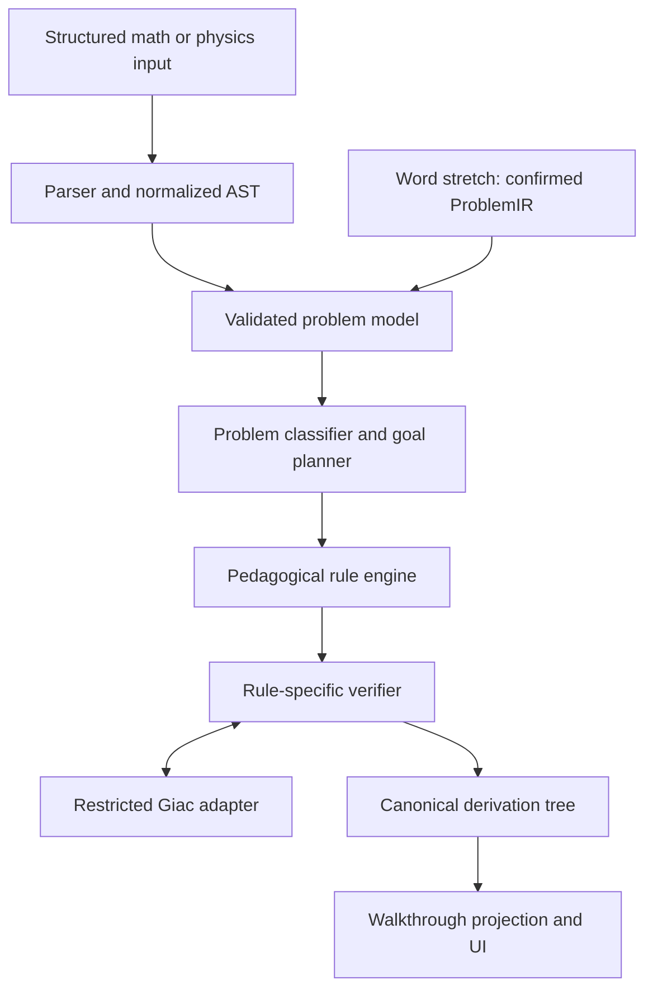
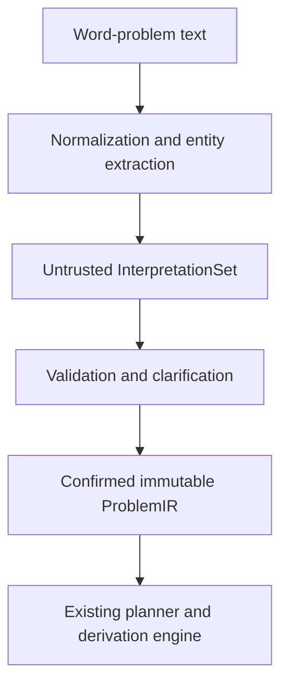

# StepCAS Product Requirements Document

> **Working title:** StepCAS  
> **Document status:** Draft v0.8, calculus and retained UI requirements expanded
>
> **Target hardware:** TI-Nspire CX II non-CAS  
> **Runtime:** TI-Nspire OS with ndl  
> **Primary symbolic backend:** Giac linked into the native StepCAS module
>
> **Last updated:** September 9, 2026

## How to use this document

This PRD defines product requirements, release gates and the proposed roadmap. Read the relevant numbered sections for the task. Dated implementation notes record decisions and evidence from their stated dates. They do not establish current release acceptance.

| Task | Read |
|---|---|
| Establish product scope and support claims | [Product principles](#4-product-principles), [coverage contract](#54-coverage-and-product-claim-contract) and [symbolic-support contract](#55-symbolic-support-contract) |
| Find requirement IDs and priorities | [Functional requirements](#9-functional-requirements), [resource requirements](#16-performance-and-resource-requirements) and [stretch requirements](#2611-stretch-requirements) |
| Change solving, verification or presentation | [Derivation model](#10-the-derivation-model), [rule engine](#11-rule-engine-requirements), [backend trust boundary](#123-backend-trust-boundary), [detail levels](#14-detail-levels) and [outcomes](#15-error-and-uncertainty-behavior) |
| Assess MVP or family acceptance | [Testing strategy](#19-testing-strategy), [MVP criteria](#202-mvp-success-criteria), [acceptance corpus](#221-mvp-acceptance-corpus), [coverage governance](#27-coverage-governance) and [supported-problem definition](#28-definition-of-done-for-a-supported-problem) |
| Work on word-problem interpretation | [Stretch scope](#262-scope-boundaries), [parser-to-solver boundary](#265-parser-to-solver-data-boundary) and [evaluation gates](#2614-evaluation-and-release-gates) |
| Recover decision history | [Recorded decisions](#24-decisions-already-made), [open questions](#25-open-product-questions) and [revision history](#29-revision-history) |

For current source relationships, use the [codebase map](codebase-map.md). Build and test commands live in [nps/README.md](../nps/README.md). Declared family envelopes live in the [coverage catalog](../nps/catalog/families.md).

The [traceability reader](../nps/tools/traceability.cc) consumes the requirement tables directly. Keep IDs, priorities and requirement text in those rows. The navigation above is an index, not an additional requirement set.

## 1. Executive summary

StepCAS is an offline educational mathematics and physics application for the non-CAS TI-Nspire CX II. Within each explicitly declared supported family, it will provide exact symbolic computation while teaching the user how to solve a problem through a complete, navigable, step-by-step derivation.

The defining feature is not merely that StepCAS displays intermediate expressions. The engine must **solve through explicit mathematical rules** and preserve a trustworthy record of why each transformation is valid. Every displayed mathematical transformation must include the operation or rule used, the expression before and after the operation, relevant assumptions or domain restrictions, and verification evidence. Plan and check steps must state their strategy or validation rationale.

StepCAS will use Giac as its symbolic computation backend and as one source of verification evidence, but it will not depend on Giac to invent educational explanations or serve as its own sole proof of correctness. A separate pedagogical step engine will select transformations and record a fine-grained derivation. Rule-specific invariants, assumption tracking, candidate substitution, dimensional analysis, and Giac cross-checks will then validate the trace. The result should feel like a patient tutor embedded in the calculator rather than a CAS that only returns an answer.

The initial product will focus on foundational algebra, single-variable calculus, and introductory calculus-based physics. The end-state product targets the common calculus and physics problem families students are routinely expected to solve by hand. It must run on the non-CAS CX II through ndl without replacing or modifying the stock TI operating system.

## 2. Problem statement

The current TI-Nspire ecosystem contains the necessary pieces, but not a mature product that combines them on the non-CAS CX II:

| Software | Runs on non-CAS CX II through ndl | Symbolic computation | Teachable steps |
|---|---:|---:|---:|
| KhiCAS | Yes | Excellent | Limited |
| SD2 derivative solver | No, designed for TI-Nspire CAS | Yes | Excellent |
| SINT integration solver | No, designed for TI-Nspire CAS | Yes | Yes |
| SIPP integration by parts | No, designed for TI-Nspire CAS | Yes | Yes |
| nSolver equations | No, designed for TI-Nspire CAS | Yes | Yes |
| Mature general step solver | No verified option | — | — |

Students using a non-CAS CX II therefore face a choice between symbolic answers without a comprehensive explanation and specialized step solvers that depend on a CAS-model calculator. StepCAS will close this gap.

This table is a product-discovery snapshot, not a permanent compatibility guarantee. Exact versions, source availability, licenses, and reuse feasibility must be revalidated during Milestone 0 before any existing solver code is adopted.

## 3. Product vision

StepCAS will let a student enter a mathematical expression, equation, or structured physics problem and then:

1. understand what is being asked;
2. identify the applicable concepts and equations;
3. choose a valid strategy;
4. work through the solution one justified transformation at a time;
5. inspect why each rule applies;
6. preserve exact symbolic values for as long as possible;
7. verify the final result, its domain, and its physical units; and
8. request a numerical approximation only when desired.

The intended experience is:

> **Show me how to solve this, let me follow each decision, and give me a result I can trust.**

## 4. Product principles

### 4.1 Derivation-first, not answer-first

StepCAS must not calculate a final result and then fabricate a likely sequence of steps. The selected mathematical rules and transformations are the computation. The final answer is the last state of the recorded derivation.

Giac may simplify, normalize, solve subproblems, and verify equivalence, but the user-facing solution must come from an explicit step trace owned by StepCAS.

The canonical trace shall be fine-grained enough to audit. Beginner, standard, and concise views are projections of that trace; they must never replace it with separately generated narratives.

### 4.2 Every step must be justified

Every user-visible transformation must answer:

- What changed?
- Which rule or law permits the change?
- Why does that rule apply here?
- Were any assumptions or restrictions introduced?
- How can the user perform the same kind of step themselves?

### 4.3 Symbolic by default

Exact fractions, radicals, constants, variables, units, and expressions must remain symbolic unless the user requests an approximation or an exact representation is unavailable.

For example:

\[
\frac{\sqrt{2}}{2}
\]

must not silently become `0.70710678`.

### 4.4 Correctness before coverage

An unsupported problem must produce a clear limitation message. The product must never disguise an unverified or incomplete derivation as a valid solution.

StepCAS must also distinguish between a mathematically valid rewrite, a complete solution-set transformation, a checked calculus result, and a physically applicable modeling choice. These claims require different verification methods and must not be collapsed into a single generic “verified” flag.

### 4.5 Progressive disclosure

A beginner must be able to see every algebraic operation. A more experienced user must be able to collapse routine simplification and focus on major conceptual steps.

### 4.6 Offline and deterministic

All solving, verification, and explanation must occur on the calculator. The shipped product must not require an internet connection, cloud service, or generative AI model.

This applies to every product feature, including the word-problem stretch goal. Text interpretation, quantity extraction, semantic modeling, clarification, problem-family selection, symbolic solving, verification, and walkthrough rendering must all execute locally on the calculator. A phone, computer, companion application, remote API, or external model may not perform any runtime part of the solution.

### 4.7 Giac is a backend, not the pedagogy engine

Giac may answer symbolic queries and cross-check results. StepCAS remains responsible for choosing a teachable strategy, recording the actual transformations, preserving domains and conditions, and explaining the work. A Giac result alone is never sufficient to mark a problem type as supported.

### 4.8 Plan, execute, and check

A complete walkthrough must expose three levels of reasoning:

1. **Plan:** identify the goal and select a strategy or physical model;
2. **Execute:** apply justified symbolic transformations; and
3. **Check:** test the result against the original problem, assumptions, and units.

### 4.9 Calculator self-sufficiency

The calculator is the complete runtime system. Development computers may compile the application, generate static tables, and run tests, but the installed application must contain everything required to interpret and solve a supported problem. External tooling may not be required after installation.

Self-sufficiency is a runtime claim, not a claim that installation happens without a computer. A documented installation process may transfer StepCAS, ndl, and compatible local dependencies to the calculator. Once installed, however, solving a supported problem must not require a live USB connection, linked computer, phone, network, remote service, or computation performed outside the calculator.

### 4.10 Reproducible teaching, not unexplained leaps

A student must be able to reproduce a displayed step using the information presented by StepCAS. Each teachable transformation must identify the target subexpression or quantities, the action to perform, the conditions that permit it, and the resulting expression. “Simplify,” “solve,” “by CAS,” or “after algebra” is not an acceptable explanation when it hides one or more conceptual operations.

The application may group routine semantic steps for presentation, but those steps must remain expandable. If a backend operation cannot be decomposed into registered transformations at the selected teaching level, the application must label that subproblem as opaque and unsupported for walkthrough purposes rather than presenting the backend result as shown work.

### 4.11 Deterministic, versioned behavior

For the same application version, capability manifest, problem model, user-selected method, assumptions, detail level, angle mode, numeric policy, and resource limits, StepCAS shall produce the same canonical derivation and outcome. Editor suggestions and local history may improve entry convenience but shall not silently change the committed problem model or solution strategy. Any setting that can change mathematical behavior must be visible and serialized with saved work.

## 5. Goals

### 5.1 Primary goals

- Run reliably on a non-CAS TI-Nspire CX II through ndl.
- Provide exact symbolic input, manipulation, and results.
- Show complete, ordered, mathematically valid work.
- Teach the rule, identity, theorem, or physical law behind each important step.
- Support foundational algebra required by calculus and physics.
- Support core single-variable calculus workflows.
- Support structured introductory physics problems with symbolic quantities and units.
- Require recorded, rule-appropriate validation evidence for every accepted mathematical transformation; otherwise report the subproblem as unsupported or unverifiable.
- Provide a calculator-friendly UI designed for the 320 × 240 display and keypad.

### 5.2 Secondary goals

- Reuse or adapt proven ideas from existing open-source TI-Nspire step solvers where licensing permits.
- Permit future solver modules without redesigning the core engine.
- Provide a host-side test runner so most logic can be tested without repeatedly deploying to a calculator.
- Allow derivations to be saved, reopened, and inspected later.
- Provide a stretch path for translating common calculus and physics word problems into the same verified structured representation used by direct problem entry.

### 5.3 End-state coverage goal

The narrow MVP is a sequencing decision, not the final scope. The end-state product shall solve and teach the common problem families encountered across:

- algebra and trigonometry prerequisites used by calculus and physics;
- standard single-variable Calculus I and II;
- the common parts of multivariable and vector calculus;
- introductory ordinary differential equations used in science and engineering; and
- the standard high-school through introductory university calculus-based physics sequence.

Physics end-state coverage includes measurement and units, vectors, kinematics, mechanics, gravitation, rotation, oscillations, waves, fluids, thermodynamics, electrostatics, circuits, magnetism, electromagnetic induction, geometric and wave optics, and the common introductory problems in special relativity and modern physics.

“Common” shall not be judged by whether StepCAS can solve a few representative examples. The project shall maintain a **coverage catalog** organized by curriculum topic, problem family, required strategy, input form, assumptions, and expected derivation pattern. A family counts as supported only when it satisfies the definition of done in Section 28 across normal, boundary, conditional, and unsupported cases.

This goal does not require StepCAS to reproduce every command or advanced specialty of a desktop CAS. It requires broad, dependable coverage of problems students are routinely expected to solve by hand, with the work made visible.

Exact symbolic work remains the default. When a common problem intentionally requires a numerical method, or no supported closed form exists, StepCAS may use a documented numerical method only if the approximation is explicit and the method's steps, error conditions, and stopping rule are shown.

### 5.4 Coverage and product-claim contract

“All common calculus and physics problems” is the product direction, but it is not testable until “common” and “problem” are bounded. Each major release shall therefore declare a **Reference Curriculum Set** containing the course outlines, textbooks, open problem banks, and exam frameworks used to define its coverage. The set shall be versioned and shall record edition, chapter or objective, jurisdiction where relevant, and the date it was adopted.

The project shall decompose that reference set into atomic problem families. A family is distinguished when it changes any of the following: governing model, required strategy, applicable theorem, domain, representation, branch behavior, input information pattern, or verification method. Cosmetic changes to names or numbers do not create a new family.

A release may make only the following claim types:

| Claim | Meaning |
|---|---|
| **Topic available** | At least one explicitly listed family in the topic is supported; no implication of topic completeness. |
| **Catalog family supported** | The exact family envelope satisfies Sections 27 and 28, including declared parameter and representation limits. |
| **Course coverage** | Every mandatory family derived from the named Reference Curriculum Set is supported. If gaps remain, only a qualified coverage report naming those gaps is permitted. |
| **Input-mode coverage** | A separate claim stating whether those families accept structured entry, direct symbolic entry, controlled word input, or another released input mode. |
| **Method coverage** | A separate claim listing the solution methods for which StepCAS can produce a verified walkthrough. |

Solver coverage and language-understanding coverage are independent. A physics family can be fully supported through structured entry while its prose form remains unsupported; the product must not market that as word-problem support. Likewise, recognizing a word problem does not count as supporting it unless the downstream planner, derivation engine, and verifier satisfy the normal family release gate.

The long-term “all common” claim may be used only against a named, frozen Reference Curriculum Set whose mandatory families have reached coverage closure. New editions and newly adopted curricula create a new coverage target; they do not silently invalidate historical reports or silently expand a shipped release's claim.

### 5.5 Symbolic-support contract

“Full symbolic support” means full symbolic behavior **inside a declared family envelope**, not unrestricted parity with a desktop CAS. Every family entry shall specify:

- accepted expression grammar and operators;
- variable domains and parameter assumptions;
- exact input and output forms;
- supported methods and branch cases;
- special functions, if any;
- singularities, degeneracies, and excluded forms;
- whether a closed form is expected, conditional, unavailable, or intentionally numerical; and
- the verification obligations required for a complete result.

Within that envelope, the solver shall preserve symbolic parameters, exact constants, conditions, branches, and solution sets without silently substituting sample values or decimals. Outside that envelope, it shall return a typed limitation. A family shall not be labeled fully symbolic if it works only after inserting numbers, loses parameter conditions, returns only one branch, or delegates an unexplained final form to Giac.

## 6. Non-goals for the initial release

- Replacing the stock TI-Nspire operating system or built-in Calculator application.
- Installing TI's proprietary CAS software on a non-CAS device.
- Hiding CAS functionality from exam administrators or bypassing exam restrictions.
- Free-form natural-language understanding of arbitrary physics word problems in the initial release. Controlled, fully on-calculator word-problem understanding is defined as a stretch goal in Section 26.
- Supporting every topic found in a full desktop CAS.
- Producing formal computer-assisted proofs for all transformations.
- Cloud synchronization or online accounts.
- On-device generative AI.
- Automatic recognition of handwritten equations or diagrams.
- Three-dimensional graphing or a full dynamic geometry environment.

## 7. Target users

### 7.1 Primary user

A high-school or early university student who owns a non-CAS TI-Nspire CX II and needs help learning algebra, calculus, or introductory physics while working away from a computer.

### 7.2 Secondary users

- Students checking their own handwritten work.
- Tutors demonstrating consistent solution methods.
- Developers extending the application with new rule modules.

## 8. Core user journeys

### 8.1 Learn a derivative

The user enters:

\[
\frac{d}{dx}\left(x^2\sin x\right)
\]

StepCAS identifies a product, states the product rule, applies it without prematurely simplifying, differentiates each factor, and then simplifies the result:

\[
(fg)'=f'g+fg'
\]

\[
\frac{d}{dx}(x^2)\sin x+x^2\frac{d}{dx}(\sin x)
\]

\[
2x\sin x+x^2\cos x
\]

The user can expand a step to see why `x²` uses the power rule and `sin(x)` differentiates to `cos(x)`.

### 8.2 Solve an equation with visible operations

The user enters:

\[
2x+5=13
\]

StepCAS shows the goal of isolating `x`, subtracts 5 from both sides, simplifies both sides, divides both sides by 2, and checks the result by substitution.

### 8.3 Solve a physics problem from structured inputs

The user selects **Kinematics → Constant acceleration**, chooses the unknown `v`, and enters:

- `v₀ = 5 m/s`
- `a = 3 m/s²`
- `t = 4 s`

StepCAS:

1. lists known and unknown quantities;
2. selects `v = v₀ + at` because it contains the unknown and all required knowns;
3. checks unit compatibility;
4. substitutes values with units;
5. simplifies units and arithmetic; and
6. reports `v = 17 m/s` with an optional sign/direction interpretation.

### 8.4 Ask for the next hint rather than the answer

The user enters a problem and selects **Hint mode**. StepCAS reveals only the next goal or relevant rule. The user may attempt the next transformation before asking StepCAS to evaluate it.

## 9. Functional requirements

Priority labels are **P0** for the mandatory vertical MVP, **P1** for the post-MVP core roadmap, and **P2** for broader end-state expansion. P1 is a pool of high-value capabilities, not a promise that every P1 row ships in one monolithic release. Each release plan shall name the exact P1/P2 families it adopts and shall apply the normal traceability and release gates to them. **INV** marks a product invariant that applies to every release stage, including future stretch features, without pulling those future features into the MVP.

### 9.1 Platform and runtime

| ID | Priority | Requirement |
|---|---:|---|
| PLAT-001 | P0 | The application shall run on a non-CAS TI-Nspire CX II supported by the selected ndl toolchain. |
| PLAT-002 | P0 | The application shall run as a separate ndl application and shall not modify the stock Calculator app. |
| PLAT-003 | P0 | All core functionality shall work offline. |
| PLAT-004 | P0 | The application shall use Giac through a supported native or Lua bridge for symbolic services. |
| PLAT-005 | P1 | Builds shall be reproducible from documented source and toolchain versions. |
| PLAT-006 | P0 | The application shall detect an unavailable or incompatible Giac bridge and present recovery instructions instead of crashing. |
| PLAT-007 | INV | Every released feature shall execute completely on the calculator after installation, including parsing, word-problem interpretation, planning, solving, verification, and explanation. |
| PLAT-008 | INV | No released feature shall require a phone, computer, companion process, network connection, remote API, or externally hosted model at runtime. |
| PLAT-009 | INV | Each build shall publish a machine-readable local capability manifest containing the StepCAS version, supported calculator models and OS/ndl combinations, symbolic-backend version and interface, installed solver/content modules, schema versions, and integrity identifiers. |
| PLAT-010 | P0 | Milestone 0 shall choose and document one deployment contract: bundle the compatible Giac runtime with StepCAS where licensing permits, or require a separately installed local Giac component and validate its exact interface and version before solving. **Chosen 2026-09-02: bundle it.** The runtime is our own giac 1.9.0 cross build, and the document reads its version from Giac at first paint rather than carrying one (see question 15 in section 25 and .Internal/ki-port.md). **Amended 2026-09-03: bundled means linked in.** Giac was a second image, `luagiac.luax.tns`, loaded beside the native core, and a backend call inside a derivation left C++ for the Lua interpreter and came back. That indirection was never the design, only what was reachable while the two were separate images. Ki V4 links Giac into the native core and ships one artefact, `ki.luax.tns`: one set of static constructors, direct backend calls, and no re-entrancy into Lua while Giac runs. It is 3862524 bytes against 3937710 for the pair it replaces. `luagiac.luax.tns` remains the Ki V3 arrangement and remains buildable. See .Internal/ki-v4.md. |
| PLAT-011 | INV | A release shall pass an isolated-device test in which all supported solves run with no USB link, paired device, network path, host process, or removable runtime dependency. |
| PLAT-012 | INV | Missing, corrupt, or incompatible runtime assets shall disable only the affected capabilities where safe, expose the reduced capability manifest, and never fall back to outside computation. |
| PLAT-013 | INV | Mathematical behavior shall be reproducible from the serialized problem context and capability manifest; hidden device state, wall-clock time, or local entry history shall not alter the canonical derivation. |
| PLAT-014 | P0 | Prefer established, maintained libraries over custom replacements. Giac shall remain the preferred symbolic backend. ETL and EASTL shall complement STL where explicit bounds or measured target performance justify their use. |
| PLAT-015 | P0 | Native resource ownership shall use RAII and smart pointers where applicable. Prefer exclusive ownership for heap resources, reserve shared ownership for shared lifetimes and keep borrowed views within the owner's lifetime. Resident cleanup shall account for runtime paths that bypass C++ finalization. |

### 9.2 Mathematical input and representation

| ID | Priority | Requirement |
|---|---:|---|
| MATH-001 | P0 | The system shall parse integers, exact rational numbers, decimals, variables, functions, powers, radicals, constants, equations, and inequalities into an internal abstract syntax tree. |
| MATH-002 | P0 | The system shall preserve exact values and shall not introduce floating-point approximations without an explicit request or a documented numerical-only operation. |
| MATH-003 | P0 | The system shall support two-dimensional mathematical display for fractions, powers, roots, integrals, derivatives, vectors, and units. |
| MATH-004 | P0 | The system shall distinguish assignment, equality, approximation, and identity. |
| MATH-005 | P0 | The system shall track variable assumptions such as real, positive, nonzero, integer, and domain membership. |
| MATH-006 | P1 | The system shall support piecewise expressions and interval notation. |
| MATH-007 | P1 | The system shall support user-selectable degree and radian angle modes and make the active mode visible. |
| MATH-008 | P1 | The system shall normalize syntax between StepCAS, TI MathPrint, and Giac without exposing backend-specific syntax to the user. |
| MATH-009 | P0 | Every numeric literal shall retain exactness provenance: exact integer/rational, exact symbolic constant, user-declared measured value, or approximate floating-point value. |
| MATH-010 | P0 | The default symbolic domain shall be real unless the user or problem explicitly selects another domain. |
| MATH-011 | P0 | Input shall support keypad-friendly linear syntax and TI templates for fractions, powers, roots, derivatives, indefinite and definite integrals, finite and infinite limits, one-sided directions, equations and units. Template insertion shall preserve existing input, expose editable arguments and place the caret predictably. |
| MATH-012 | P0 | The system shall preserve both the user's original expression and its normalized AST so that backend canonicalization does not erase the form being explained. |
| MATH-013 | INV | Each supported family shall declare its symbolic envelope: grammar, domains, assumptions, exact forms, branches, special functions, excluded forms, supported methods, and verification obligations. |
| MATH-014 | INV | Within a declared symbolic envelope, StepCAS shall preserve symbolic parameters and complete conditional or branched results; it shall not substitute arbitrary numeric examples to obtain an answer. |
| MATH-015 | INV | When a result has no supported closed form, StepCAS shall distinguish unevaluated exact form, supported special-function form, explicit numerical approximation, and unsupported operation. |
| MATH-016 | P0 | The normalized problem context shall include every setting that can change mathematical meaning, including domain, assumptions, angle mode, branch convention, unit system, numeric policy, and requested method. |

### 9.3 Step-generation engine

| ID | Priority | Requirement |
|---|---:|---|
| STEP-001 | P0 | The engine shall create the solution as an ordered derivation of explicit rule applications rather than reconstructing steps from a final answer. |
| STEP-002 | P0 | Every mathematical transformation step shall contain a before-state, after-state, rule identifier, human-readable rule name, and short explanation. |
| STEP-003 | P0 | Every step shall have a kind such as plan, transformation, branch, substitution, unit conversion, or check, and shall record the assumptions and restrictions relevant to that kind. |
| STEP-004 | P0 | The engine shall validate each transformation with a rule-appropriate method before marking it accepted. The method and strength of the evidence shall be recorded. |
| STEP-005 | P0 | The engine shall stop and report an unsupported or unverifiable transition rather than continue with speculative work. |
| STEP-006 | P0 | The engine shall distinguish reversible transformations from transformations that may add or remove candidate solutions. |
| STEP-007 | P0 | The engine shall check candidate solutions when operations may introduce extraneous results, including squaring, multiplying by possibly zero expressions, and clearing denominators. |
| STEP-008 | P0 | The user shall be able to expand or collapse substeps without changing the mathematical result. |
| STEP-009 | P0 | The user shall be able to select a step and view a fuller explanation of how to perform that operation. |
| STEP-010 | P0 | The user shall be able to choose standard or beginner detail levels; concise presentation is P1. |
| STEP-011 | P0 | The derivation model shall support nested substeps and solution branches even if the first MVP solvers use only a subset of branching behavior. |
| STEP-012 | P1 | The engine shall support hint-only progression that reveals no later steps until requested. |
| STEP-013 | P1 | The user shall be able to attempt a transformation and receive deterministic feedback explaining whether it is equivalent and pedagogically valid. |
| STEP-014 | P1 | The engine shall distinguish algebraically valid work from a strategically useful next step. |
| STEP-015 | P2 | The system shall offer more than one valid solution method when supported and explain the tradeoff between methods. |
| STEP-016 | P0 | Presentation detail shall aggregate or expand the canonical fine-grained trace; it shall not synthesize a separate solution after the fact. |
| STEP-017 | P0 | The walkthrough shall expose the solution plan before execution and a final check after execution. |
| STEP-018 | P0 | The engine shall detect repeated canonical states, rewrite cycles, and expression-growth limits. |
| STEP-019 | P0 | A backend result that cannot be decomposed into registered, verified transformations shall not be presented as a teachable walkthrough. It may be used only as a diagnostic cross-check or reported as an unsupported opaque subproblem. |
| STEP-020 | P0 | No presentation level may collapse several transformations into a line that appears to use a rule different from the underlying semantic steps. |
| STEP-021 | INV | Every teachable transformation shall identify the selected expression or quantities, the concrete action and operands, applicable preconditions, resulting state, and how the user can recognize when to use the rule again. |
| STEP-022 | INV | Generic phrases such as “simplify,” “solve,” “after algebra,” or “by CAS” shall not stand in for omitted conceptual transformations. Any such label shall expand to the registered semantic steps or be marked opaque and unsupported. |
| STEP-023 | P0 | Backend calls may propose subresults or rank search choices, but an accepted user-facing transition shall still be generated forward by a registered rule. A known or suspected final answer shall not be used to work backward into a plausible derivation. |
| STEP-024 | P0 | Branching rules shall record whether branches are exhaustive, mutually exclusive, and domain-consistent; a derivation shall not be complete until every feasible branch is solved or explicitly rejected with evidence. |
| STEP-025 | P0 | A partially solved derivation shall preserve its verified prefix but shall not display a terminal answer for the unresolved original goal. Any backend diagnostic answer shall remain segregated from the walkthrough. |
| STEP-026 | P1 | Explanation review shall include a transfer task: a learner who reads a rule explanation should be able to identify and perform the same next step on a structurally comparable problem. |

### 9.4 Algebra and trigonometry foundation

| ID | Priority | Requirement |
|---|---:|---|
| ALG-001 | P0 | Simplify arithmetic and algebraic expressions with visible operations. |
| ALG-002 | P0 | Expand, collect, and factor polynomial expressions. |
| ALG-003 | P0 | Solve single-variable linear equations. |
| ALG-004 | P1 | Solve quadratic equations by factoring and the quadratic formula. |
| ALG-005 | P1 | Manipulate rational expressions while preserving denominator restrictions. |
| ALG-006 | P1 | Manipulate powers and radicals while preserving real-domain conditions. |
| ALG-007 | P0 | Rearrange formulas symbolically to isolate a requested variable. |
| ALG-008 | P1 | Solve common polynomial, rational, radical, exponential, logarithmic, absolute-value, and trigonometric equations. |
| ALG-009 | P1 | Solve and represent linear, quadratic, rational, and absolute-value inequalities using intervals. |
| ALG-010 | P1 | Apply and explain core trigonometric identities. |
| ALG-011 | P1 | Work with two-dimensional and three-dimensional vectors in component and unit-vector form. |
| ALG-012 | P0 | Check final candidates through substitution into the original problem. |
| ALG-013 | P1 | Solve systems of linear equations with explicit elimination or substitution steps. |

### 9.5 Calculus

| ID | Priority | Requirement |
|---|---:|---|
| CALC-001 | P1 | Compute native walkthroughs for cataloged finite, infinite and one-sided limits using checked limit laws and algebraic transformations. Removable discontinuities shall retain excluded-point conditions. Distinguish an infinite limit, a nonexistent two-sided limit and an unsupported family. |
| CALC-002 | P0 | Differentiate constants, powers, sums, products, quotients, compositions, exponential functions, logarithms, and common trigonometric functions. |
| CALC-003 | P0 | Display the derivative rule before or alongside its native application. Admit explicit first-derivative order without silently accepting an unsupported higher order. |
| CALC-004 | P0 | Compute indefinite integrals for supported elementary forms and include the constant of integration. |
| CALC-005 | P1 | Compute native definite-integral walkthroughs by establishing interval validity, verifying an antiderivative, substituting the bounds and subtracting in the requested orientation. Equal and reversed bounds shall preserve domain requirements. Improper or singular intervals require a separately declared method or an explicit refusal. |
| CALC-006 | P1 | Show substitution and integration-by-parts methods as explicit variable transformations. |
| CALC-007 | P1 | Support implicit differentiation and explain dependent-variable derivatives. |
| CALC-008 | P1 | Support related-rates setups using declared quantities and units. |
| CALC-009 | P1 | Support critical points, increasing/decreasing intervals, concavity, and first/second derivative tests. |
| CALC-010 | P1 | Support tangent-line and linearization problems. |
| CALC-011 | P2 | Support common convergence tests and finite Taylor/Maclaurin polynomial derivations. |
| CALC-012 | P2 | Support separable first-order differential equations. |
| CALC-013 | P1 | Support parametric and polar curves, including derivatives, tangent slopes, area, and arc length for common forms. |
| CALC-014 | P1 | Support sequences, series, convergence tests, power series, and Taylor/Maclaurin expansions at the level of a standard Calculus II course. |
| CALC-015 | P2 | Support partial derivatives, gradients, directional derivatives, constrained optimization, and tangent planes. |
| CALC-016 | P2 | Support common double and triple integrals with coordinate transformations and explicit bounds reasoning. |
| CALC-017 | P2 | Support vector fields, line integrals, surface integrals, divergence, curl, and common applications of Green's, Stokes', and divergence theorems. |
| CALC-018 | P2 | Support common first- and second-order ordinary differential equations used in introductory science and engineering courses, with method selection shown. |
| CALC-019 | P2 | Support common numerical root-finding, differentiation, integration, and differential-equation methods when explicitly requested, including visible iteration, stopping criteria, and error limitations. |
| CALC-020 | P1 | Distinguish a supported elementary closed form, a supported special-function form, an explicitly numerical result, and an unsupported symbolic form without inventing an elementary answer. |

### 9.6 Physics

Physics support shall be built on top of the same symbolic step system. It must explain the modeling and equation-selection steps, not merely substitute numbers into a hidden formula.

| ID | Priority | Requirement |
|---|---:|---|
| PHYS-001 | P0 | The system shall represent physical quantities as a symbolic magnitude plus dimensions, units, exactness provenance, and optional vector direction. |
| PHYS-002 | P0 | The system shall perform dimensional analysis before and after substitutions. |
| PHYS-003 | P0 | The system shall list known quantities, unknown quantities, assumptions, and the selected coordinate convention. |
| PHYS-004 | P0 | The system shall explain why a physical law or equation applies to the stated conditions. |
| PHYS-005 | P0 | The system shall solve the selected physical equation symbolically for the unknown before substituting numerical values. |
| PHYS-006 | P0 | The system shall carry units through intermediate steps and simplify units visibly. |
| PHYS-007 | P0 | The system shall support one-dimensional constant-acceleration kinematics with an explicit positive direction. |
| PHYS-008 | P1 | The system shall support Newton's laws, free-body force sums, friction, tension, weight, and normal force in structured problems. |
| PHYS-009 | P1 | The system shall support work, kinetic energy, gravitational potential energy, power, impulse, and linear momentum. |
| PHYS-010 | P1 | The system shall support uniform circular motion, torque, angular kinematics, rotational energy, and angular momentum. |
| PHYS-011 | P1 | The system shall support gravitation, simple harmonic motion, and basic mechanical waves. |
| PHYS-012 | P1 | The system shall support electrostatics, electric potential, DC circuits, and equivalent resistance. |
| PHYS-013 | P0 | The system shall support SI prefixes and the base and derived SI units required by MVP kinematics. Additional units are P1. |
| PHYS-014 | P0 | The system shall convert compatible MVP units through visible conversion-factor steps using exact scale factors. |
| PHYS-015 | P1 | The system shall preserve significant figures for measured numerical data and separate significant-figure policy from exact symbolic arithmetic. |
| PHYS-016 | P1 | The system shall represent vector components with declared axes and reconstruct magnitude/direction with quadrant-correct inverse trigonometry. |
| PHYS-017 | P2 | The system shall support structured free-body and vector diagrams using calculator-appropriate primitives. |
| PHYS-018 | P2 | The system shall support fluids, temperature, heat, thermodynamics, and kinetic-theory problem families common to introductory physics. |
| PHYS-019 | P1 | The system shall support two-dimensional constant-acceleration kinematics using declared axes and vector components. |
| PHYS-020 | P1 | The system shall attach uncertainty and significant-figure metadata to measured inputs without contaminating exact symbolic constants. |
| PHYS-021 | P2 | The system shall support magnetic forces and fields, electromagnetic induction, inductance, and common Maxwell-equation applications at the introductory level. |
| PHYS-022 | P2 | The system shall support geometric optics, interference, diffraction, and other common introductory wave-optics problems. |
| PHYS-023 | P2 | The system shall support common introductory special-relativity problems with explicit frame and sign conventions. |
| PHYS-024 | P2 | The system shall support common introductory quantum, atomic, nuclear, and particle-physics calculations whose solution methods fit the verified symbolic architecture. |
| PHYS-025 | P1 | Every physics module shall expose model-selection conditions, governing laws, coordinate conventions, and checks in addition to algebraic steps. |
| PHYS-026 | INV | Selecting a physical model shall create an applicability record mapping every required condition to a stated fact, a user-confirmed assumption, or a typed unresolved condition. Dimensional consistency alone shall never establish model applicability. |
| PHYS-027 | INV | The system shall distinguish physical modeling assumptions from mathematical domain assumptions and shall show where each assumption affects the equations or result. |
| PHYS-028 | P1 | Multi-stage physics problems shall preserve event, state, body, frame, and interval identity so quantities from different stages cannot be substituted interchangeably. |
| PHYS-029 | INV | A physically impossible, contradictory, or underdetermined problem shall not be forced to a numeric answer merely because an equation can be algebraically solved. |

### 9.7 Verification and correctness

| ID | Priority | Requirement |
|---|---:|---|
| VER-001 | P0 | Algebraic identity transformations shall be validated by rule-local invariants and cross-checked by symbolic simplification under recorded assumptions when available. |
| VER-002 | P0 | Equation transformations shall be checked for equivalence or explicitly classified as implication-only transformations. |
| VER-003 | P0 | Finite candidate solutions shall be substituted into the original problem. If a supported family requires another final-validation method, that method shall be registered and visible; validation may not be silently omitted as “impractical.” |
| VER-004 | P0 | Derivative results shall be compared with Giac's derivative result after normalization. This is a backend cross-check, not an independent proof when Giac also evaluated a suboperation. |
| VER-005 | P0 | Antiderivatives shall be checked by differentiating the result. |
| VER-006 | P1 | Definite integrals shall be cross-checked against a separate Giac evaluation path when supported. |
| VER-007 | P0 | Physics equations and additions shall be dimensionally consistent. |
| VER-008 | P0 | A verification failure shall identify the failing step and prevent the derivation from being presented as complete. |
| VER-009 | P1 | Numerical spot checks may supplement symbolic checks but shall never be presented as proof of general symbolic equivalence. |
| VER-010 | P1 | Each solver rule shall have positive, negative, boundary, and regression test cases. |
| VER-011 | P0 | Verification results shall identify their claim type and evidence strength: structurally valid, symbolically equivalent under assumptions, implication-only, candidate-checked, dimensionally valid, numerically corroborated, unsupported, or failed. |
| VER-012 | P0 | A rule shall not use the exact same unchecked backend result as both the source of a transformation and the sole evidence that the transformation is correct. |
| VER-013 | P0 | Explanatory plan steps shall be checked against registered strategy preconditions; they shall not be mislabeled as algebraic equivalence proofs. |
| VER-014 | P0 | A verifier result of unknown, timeout, malformed, or unavailable shall not be treated as passed; the derivation shall become partial, unsupported, or resource-limited as appropriate. |
| VER-015 | P1 | Diagnostics shall report verification coverage by semantic transformation and identify which checks are rule-local, Giac cross-checks, candidate substitutions, calculus inverse checks, dimensional checks, or numerical corroboration. |
| VER-016 | P0 | Every rule and strategy shall declare a proof-obligation schema defining the exact claim being made, required evidence, allowable evidence combinations, and failure behavior. |
| VER-017 | P0 | Solution-set claims shall verify both soundness and completeness within the declared family envelope: returned candidates satisfy the original problem, and no admissible branches or cases are silently omitted. |
| VER-018 | P1 | Numerical methods shall record iteration states, convergence preconditions, stopping criterion, error estimate or limitation, precision, and failure-to-converge behavior. A decimal result alone is not verification. |
| VER-019 | INV | User confirmation may resolve an interpretation or choose an assumption, but it shall never convert failed mathematical, dimensional, model-applicability, or proof obligations into passed verification. |
| VER-020 | P1 | Reopened derivations shall state whether they are archived verified records under their original manifest or have been successfully revalidated under the current engine; a version change shall not silently imply renewed verification. |

### 9.8 User interface

| ID | Priority | Requirement |
|---|---:|---|
| UI-001 | P0 | The primary interface shall be usable with the TI-Nspire keypad and touchpad without an external device. |
| UI-002 | P0 | Mathematical expressions shall use readable two-dimensional layout within the 320 × 240 display. |
| UI-003 | P0 | The solution view shall show one focused step at a time with clear previous/next navigation. |
| UI-004 | P0 | The current rule and the exact part of the expression being transformed shall be visually identifiable. |
| UI-005 | P0 | Long expressions shall support horizontal inspection without losing the current step context. |
| UI-006 | P0 | Errors shall identify the input location and provide an actionable explanation. |
| UI-007 | P1 | A derivation overview shall show major steps and collapsible substeps. |
| UI-008 | P1 | The user shall be able to switch among Solve, Walkthrough, and Hint modes. |
| UI-009 | P1 | The user shall be able to inspect definitions for rules, symbols, and physical quantities. |
| UI-010 | P1 | The user shall be able to save and reopen derivations within available storage limits. |
| UI-011 | P2 | The user shall be able to export a compact textual derivation to a computer-supported format. |
| UI-012 | P0 | The solution view shall always distinguish the current phase: Plan, Work, or Check. |
| UI-013 | P0 | The UI shall visibly distinguish exact results, conditional results, and numerical approximations. |
| UI-014 | INV | Verification evidence and assumptions may be summarized in the main walkthrough but shall be inspectable from the exact step to which they apply. |
| UI-015 | INV | Partial, unsupported, opaque, conditionally solved, and resource-limited outcomes shall remain visually distinct from a complete verified solution in every detail level and saved view. |
| UI-016 | P0 | The expanded framework shall retain widgets, layout and rendered content across unchanged paints. Content, viewport, font and focus changes shall invalidate the affected state without recomputing a solve. |
| UI-017 | P0 | Text, mathematical glyphs and native symbols shall use antialiased rendering appropriate to the display. Native coverage blending shall account for the destination background and color encoding. Retain readable TI mathematical editing and typesetting. |
| UI-018 | INV | Important input, answers, assumptions, conditions and focused controls shall remain fully reachable through wrapping, scrolling or a full-text view. Persistent headers and footers shall not cover focused content. Resize and overlay transitions shall preserve usable navigation and focus. |
| UI-019 | P0 | The retained framework shall provide reusable controls, nested layouts, focus groups and scrolling for interfaces beyond basic native drawing primitives. Use qualified LVGL facilities and make substantive use of nGC and nRGBlib where compatible with verified screen ownership. Do not depend on private Lua graphics offsets. |

## 10. The derivation model

The derivation model is the central product data structure. A derivation may be linear for simple algebra, nested for calculus, or branched when multiple cases are required.

Every record uses a common envelope, then a payload appropriate to its semantic kind. Fields that do not apply to a kind are not populated with dummy expressions or generic “verified” values.

```text
Step
  id
  parent_step_id
  step_kind
  phase
  goal
  rule_or_strategy_id
  rule_or_strategy_name
  explanation_short
  explanation_detailed
  assumptions_before
  assumptions_after
  domain_restrictions
  claim_type
  proof_obligations[]
  verification_records[]
  backend_requests
  child_steps
  payload

TransformationPayload
  before_expression
  after_expression
  transformed_subexpression_path
  concrete_action
  operands
  reversibility
  introduced_branches[]

PlanPayload
  selected_strategy
  applicability_conditions[]
  matched_problem_facts[]
  alternatives_considered[]
  selection_rationale

BranchPayload
  branch_condition
  sibling_exhaustiveness_record
  feasibility_status

CheckPayload
  target_claim
  check_method
  expected_relation
  observed_result
```

Each derivation must also carry a serialized `SolutionContext`:

```text
SolutionContext
  application_version
  capability_manifest_id
  problem_family_id
  problem_family_envelope_version
  normalized_problem_model
  requested_method
  active_domains_and_assumptions
  angle_and_branch_conventions
  unit_and_numeric_policy
  detail_projection
  resource_policy
  rule_and_content_pack_versions
  derivation_status
```

The context is part of reproducibility evidence. It prevents a saved answer from becoming detached from the rules, assumptions, backend, and limits under which it was produced.

Example:

```text
Goal: Isolate x
Before: 2x + 5 = 13
Rule: Subtraction property of equality
Action: Subtract 5 from both sides
After: 2x = 8
Why: Applying the same operation to both sides preserves equality
Assumptions introduced: None
Reversible: Yes
Claim: Equation solution set preserved
Verification: Rule-local equality invariant plus Giac equivalence cross-check
```

This model prevents the UI, solver, and verifier from treating a solution as an unstructured block of formatted text.

The trace shall separate **semantic steps** from **presentation groups**. Semantic steps are immutable audited transformations. Presentation groups may combine consecutive routine steps for display, but must retain links to every underlying semantic step.

## 11. Rule engine requirements

Each rule shall define:

- a stable identifier;
- a mathematical pattern or precondition;
- the transformation it performs;
- whether the transformation is reversible;
- assumptions and restrictions it requires;
- candidate branches it may introduce;
- a user-facing explanation template;
- an expanded teaching explanation;
- one or more verification strategies;
- tests demonstrating correct and incorrect applications;
- a complexity cost and maximum permitted expression-growth factor;
- the semantic claim made by successful application; and
- provenance for its explanation and mathematical definition.

Each rule's proof-obligation schema shall state whether its claim concerns expression identity, equality preservation, implication, solution-set preservation, candidate soundness, branch completeness, calculus inversion, unit conversion, dimensional validity, numerical convergence, or physical-model applicability. A generic Boolean `verified` field is prohibited at the rule boundary.

Example conceptual rule:

```text
Rule ID: algebra.equality.subtract_both_sides
Match: L = R
Parameter: expression E
Transform: L - E = R - E
Reversible: Yes
Restriction: E must be defined on the active domain
Teaching note: The same quantity is removed from both sides, so balance is preserved
Verification: simplify((L - E) - (R - E)) is equivalent to simplify(L - R)
```

The example simplification query is supporting evidence, not the entire correctness argument. The rule-local invariant is that applying the same defined subtraction to both sides preserves the equality relation.

The rule selector shall rank possible transformations based on:

1. mathematical validity;
2. progress toward the current goal;
3. pedagogical clarity;
4. expected expression complexity;
5. avoidance of previously visited canonical states; and
6. deterministic tie-breaking.

Presentation detail shall not change the mathematical strategy. Selecting a different solution method is an explicit user or planner choice and produces a distinct canonical derivation.

## 12. Proposed architecture



Raw word-problem text does not enter the symbolic AST or solver path. The stretch interpreter must first commit a confirmed `ProblemIR`, which joins structured input only at the validated problem-model boundary.

### 12.1 Major components

#### Input and MathPrint layer

Captures keypad input, creates structured expressions, renders two-dimensional mathematics, and maps selections back to AST nodes.

#### Parser and normalized AST

Creates a backend-independent representation. The AST must be lossless enough to preserve mathematically meaningful grouping and user intent while still supporting canonical comparison.

#### Giac adapter

Provides a narrow compatibility API rather than allowing solver modules to call raw Giac strings throughout the codebase.

Initial adapter operations should include:

```text
parse
print
simplify
expand
factor
solve
differentiate
integrate
limit
substitute
assume
is_zero
is_equivalent
approximate
```

The adapter owns StepCAS-to-Giac syntax translation, result parsing, timeout/error handling, and backend normalization. It accepts typed operations over validated ASTs, not arbitrary user-provided Giac command strings.

Every adapter response shall be tagged as one of: exact result, conditional result, unevaluated result, approximate result, timeout, resource failure, backend error, malformed result, or unsupported operation. The caller must handle each tag explicitly. Backend text that cannot be parsed into the expected typed representation shall never enter a derivation state.

#### Problem classifier and planner

Determines the problem family, target quantity, relevant constraints, and candidate strategy. For physics, the planner also selects equations based on known quantities and applicability conditions.

#### Pedagogical rule engine

Owns the actual user-facing solution strategy and emits the derivation step by step. It may delegate symbolic suboperations to Giac, but it must retain the reason and context for every delegation.

#### Verifier

Checks each proposed transition before it enters the accepted derivation. Verification is specific to the operation: structural rule invariants, equivalence checking under assumptions, implication tracking, differentiation, substitution, dimensional analysis, or candidate testing. Giac output is evidence within this process, not automatically a proof.

#### Physics knowledge base

Defines quantities, dimensions, equations, applicability conditions, sign conventions, and conceptual explanations. Equations must be data-driven where practical so that topic expansion does not require duplicating solver logic. Every entry shall carry a stable ID, curriculum tags, content provenance, review status, and tests.

#### Derivation renderer

Turns verified step records into beginner, standard, or concise presentations without altering the underlying derivation.

### 12.2 Recommended implementation split

- **Lua:** calculator UI, navigation, formatting orchestration, and thin application control where Nspire APIs are most accessible.
- **Native C/C++ through ndl:** a candidate location for the AST, rule engine, unit algebra, verification coordination, and serialization if the feasibility measurements justify the integration cost.
- **Giac:** symbolic operations and backend cross-checking, linked into the native core rather than loaded beside it (PLAT-010, amended 2026-09-03).
- **Host tools:** corpus tests, fuzzing, golden derivations, performance profiling, and package creation.

The final split shall be selected only after a vertical prototype compares two options:

1. **Lua-first:** UI and orchestration in Lua using `luagiac`, with a minimal native surface.
2. **Native-core:** rule and data-model code in C++ exposed through a narrow bridge, with Lua retained for UI where advantageous.

The comparison shall measure bridge complexity, binary size, available memory, symbolic latency, crash isolation, testability, and packaging. The PRD does not assume that a mixed Lua/C++ design is automatically superior.

**Settled 2026-09-02, by construction rather than by the comparison above.** Only the native-core arm was built, because the Lua-first arm cannot answer the question: `luagiac` exposes one function taking a command string (giac-src/src/luagiac.c), so the typed adapter of 12.1 and every validation of 12.3 have to be native whichever arm wins, and a Lua-first prototype would have had to write the same native code to be comparable. Measured on the native-core arm: the bridge is one file passing text one way and a table back, the module is under 110 KB on target, it loads under the OS Lua interpreter on the emulator and the handheld, and Giac answers it. Its weakness is crash isolation: a fault in native code resets the calculator, and the Lua guard catches Lua errors only. The split is therefore the one listed at the top of this section, with the AST, rule engines, verification and serialization native. See .Internal/open-questions.md item 6.

**Amended 2026-09-03: Giac is inside the native core, not beside it.** The measurement above was taken with Giac in a second image and every backend call going out through the Lua interpreter to reach it. That was a property of the arrangement rather than of the split, and it cost the one thing the split was chosen for: a rule engine could not call its backend without re-entering the interpreter, which is what forced the Giac-first, table-after ordering in the bridge after a half-built Lua value on the stack during a re-entrant call took the calculator down. Linking Giac in removes the re-entrancy entirely. The bridge keeps that ordering anyway, so that one build cannot behave differently from the other. The reason to record here is that the narrow bridge is now genuinely one-way: Lua hands over the user's text, and nothing the rule engines do goes back through it. Verified on the emulator for all four step modes and for the shell's own Giac line, with every answer, tag and cost matching the two-image arrangement.

### 12.3 Backend trust boundary

User expressions are untrusted input. The application shall parse them into a validated AST, enforce size and depth limits, and permit only an allowlisted set of typed symbolic operations. Solver modules shall not concatenate user text into unrestricted Giac commands. Recoverable backend timeouts, recursion failures, and malformed results must become explicit resource or verification outcomes. Milestone 0 shall determine which native failures can be contained; unrecoverable process crashes require safe restart behavior and regression cases rather than a false promise of in-process recovery.

### 12.4 Explanation-content boundary

Rule explanations, model-selection notes, and common-mistake guidance shall be authored or reviewed as deterministic content associated with stable rules. They shall not be produced by an on-device language model. Content review must check mathematical accuracy, reading level, and consistency with the actual transformation.

## 13. Physics problem representation

The initial physics interface should use structured problem entry rather than unrestricted natural language.

```text
Topic: Kinematics
Model: Constant acceleration
Unknown: final velocity v
Known:
  initial velocity v0 = 5 m/s
  acceleration a = 3 m/s^2
  time t = 4 s
Axis: +x is the positive direction
Assumptions:
  acceleration is constant
```

Each physics equation record should include:

```text
Equation
  id
  topic
  curriculum_tags
  symbolic_form
  quantities
  dimensional_signature
  required_conditions
  excluded_conditions
  sign_convention_notes
  conceptual_explanation
  common_mistakes
  provenance
  review_status
  test_case_ids
```

Equation selection must be explainable. A solution should be able to state, for example:

> This equation is applicable because acceleration is constant, and it contains the requested final velocity plus only quantities whose values are known.

### 13.1 Exact and approximate numeric semantics

StepCAS shall not infer exactness inconsistently from display formatting.

- Integers, fractions, radicals, and named constants are exact unless explicitly approximated.
- In mathematics entry, a decimal literal is approximate by default; the UI shall provide an explicit exact-decimal or rational entry path when the user intends exactness.
- In physics entry, a decimal measurement is approximate and carries significant-figure metadata.
- Defined physical constants and unit scale factors may be exact or measured according to their catalog metadata.
- Approximation shall be a visible operation in the derivation, and exact expressions shall remain available for inspection when an approximation is requested.

Affine conversions such as Celsius to kelvin require dedicated conversion rules and are outside the MVP unit set. They must not be treated as ordinary multiplicative units.

## 14. Detail levels

The canonical fine-grained derivation remains identical for a chosen solution method, but rendering changes by selected detail level. A collapsed line must remain expandable to the exact semantic steps it represents.

### Beginner

- Show operations on both sides explicitly.
- Show arithmetic simplification as separate steps.
- Define each rule when first used.
- Explain common mistakes.
- Carry units through every physics line.

### Standard

- Show every conceptual transformation.
- Combine routine arithmetic when safe.
- Keep rule names visible.

### Concise

- Show major strategy changes and final checks.
- Collapse routine algebra into expandable substeps.
- Never omit domain restrictions, branches, or non-reversible operations.

## 15. Error and uncertainty behavior

StepCAS must distinguish at least these outcomes:

- **Solved and verified:** every required step passed verification.
- **Partially solved:** the engine produced a verified derivation up to a clearly identified unsupported subproblem.
- **Unsupported:** the problem class or requested method is not implemented.
- **Invalid input:** the expression, units, or problem specification is malformed or internally inconsistent.
- **Clarification required:** a word problem has multiple materially different interpretations or a required reference/assumption is unresolved.
- **Interpretation unsupported:** the text contains a construction or semantic relationship outside the installed local capability manifest.
- **Model commit failed:** a candidate interpretation failed non-overridable schema, reference, type, dimension, contradiction, completeness, or applicability validation.
- **Conditionally solved:** the result depends on stated assumptions or parameter cases.
- **Numerically approximated:** an exact symbolic form was unavailable or the user explicitly requested an approximation.
- **Verification failed:** a proposed transformation did not pass its verification strategy.
- **Resource limit reached:** the calculation exceeded configured time, memory, recursion, or expression-size limits.
- **Opaque subproblem:** a local backend produced or suggested a result that StepCAS cannot decompose into an accepted teaching derivation.
- **Dependency unavailable:** a required installed local component or asset is absent, corrupt, or incompatible; no outside fallback was attempted.

The UI must never convert these states into a generic wrong-answer message.

For every non-success outcome, the result record shall identify the responsible phase, preserve any verified prefix, state whether the original goal remains unresolved, and offer only actions that keep the trust boundary intact: edit the problem, choose a supported method, reduce complexity, inspect the verified prefix, or return to structured entry. A diagnostic backend result is not an answer to the original problem.

## 16. Performance and resource requirements

Exact limits require measurement on target hardware during the prototype, but the following requirements define intended behavior:

| ID | Priority | Requirement |
|---|---:|---|
| PERF-001 | P0 | Keypad navigation and step browsing shall feel immediate and shall not block on symbolic recomputation. |
| PERF-002 | P0 | Derivations shall be computed incrementally and cached within a documented memory budget. |
| PERF-003 | P0 | Symbolic operations shall have cancellable time or complexity limits where supported. |
| PERF-004 | P0 | The application shall fail gracefully when a problem exceeds memory or complexity limits. |
| PERF-005 | P0 | Common MVP problems shall produce the first meaningful step within a provisional two-second target on target hardware; Milestone 0 measurements may revise the bound before the MVP baseline is frozen. |
| PERF-006 | P0 | Common MVP problems shall complete within a provisional five-second target, excluding intentionally complex cases documented in the benchmark corpus; Milestone 0 shall establish final per-family budgets. |
| PERF-007 | P1 | Saved derivations shall use a versioned, compact representation. |
| PERF-008 | P0 | The solver shall enforce limits for AST depth, expression size, rewrite count, branch count, backend calls, and repeated canonical states. |
| PERF-009 | P0 | Cancelling a solve shall return control without leaving a partially accepted or mislabeled derivation. |
| PERF-010 | P0 | Milestone 0 shall freeze versioned MVP budgets for installed size, launch-time free memory, end-to-end peak memory, AST size, derivation steps, branches, backend calls, first-step latency, total latency, and cancellation response. |
| PERF-011 | INV | Performance measurements shall include the actual release configuration with UI, content, parser, Giac, verifier, derivation, and required module assets resident as they are during use; isolated microbenchmarks cannot qualify a feature. |
| PERF-012 | INV | A release may revise budgets only through a documented baseline change with target-device evidence; a failing family may not waive a frozen gate by relabeling itself “intentionally complex.” |
| PERF-013 | P0 | After cancellation, resource failure, or recoverable backend error, the application shall either restore the last committed derivation state or start a clean solve; unverified intermediate state shall not be reused. |
| PERF-014 | P0 | Unchanged UI paints shall reuse measured layout and decoded images. Measure initial layout, changed-frame rendering, image conversion, navigation and steady-state repaint separately on the physical device. |
| PERF-015 | P0 | Release builds shall use qualified linker optimizations for size and performance, including link-time optimization and unused-section removal where supported. Verify exported interfaces, startup, correctness and resource behavior against a matched baseline before adoption. |
| PERF-016 | INV | UI storage shall have explicit ownership and budgets across document close, module unload, resize and failure. Resource exhaustion shall return a recoverable outcome rather than aborting or hanging the resident application. Fixed containers shall expose capacity failure before publishing incomplete content. |

For performance reporting, the **first meaningful step** is the first accepted Plan record or verified semantic transformation that advances the user's problem; input acknowledgment, a loading indicator, or an unverified backend preview does not qualify. **Completion** means the canonical derivation and outcome classification are ready for navigation, not merely that a final expression has been found. Frozen budgets shall define a percentile target and a hard termination ceiling for each release-targeted family so a favorable average cannot hide severe device stalls.

## 17. Safety, trust, and academic-use requirements

- The application must label unverified results and incomplete derivations prominently.
- The application must not claim that a numerical spot check proves a symbolic identity.
- Domain restrictions and extraneous-solution checks must remain visible even in concise mode.
- Physics results must display units unless explicitly dimensionless.
- The documentation must state that device and exam policies vary and that users are responsible for complying with their course or testing rules.
- The product must not include features whose purpose is concealing the application during exams.
- User input shall not be forwarded as unrestricted backend commands or allowed to access files, processes, or operating-system services through Giac.
- Saved derivations shall be parsed as versioned data and shall not be executed as code.

## 18. Licensing and distribution constraints

Library selection is governed by technical fit, quality and measured device cost. The owner does not require a permissive-license restriction. The implementation shall retain dependency provenance and required notices.

- Confirm the exact licenses and corresponding-source obligations for the selected Giac/KhiCAS components.
- Preserve notices and source availability required by GPL/LGPL dependencies.
- Review each reused solver independently before copying or adapting its code.
- Keep proprietary TI components outside the distributed source except where normal SDK use permits them.
- Document build prerequisites without redistributing restricted toolchain components.

License choice shall not be used to reject an otherwise suitable dependency for this work.

## 19. Testing strategy

### 19.1 Rule-level tests

Every rule must include:

- direct success cases;
- cases where the rule must not match;
- domain boundaries;
- undefined expressions;
- branch-producing cases;
- reversibility checks; and
- known historical regressions.

### 19.2 Golden derivation tests

Representative problems shall have approved derivation trees. Tests shall compare semantic step records rather than fragile screen text alone.

Golden tests shall check both correctness and pedagogy: strategy selection, rule ordering, assumption visibility, granularity, explanation-to-transformation agreement, and final validation.

### 19.3 Differential tests

Final symbolic results should be compared against Giac. Where legally and practically possible during development, a host test suite may compare results with additional independent systems to expose backend-specific mistakes.

### 19.4 Property-based and fuzz tests

Generated expressions shall test parser round-tripping, normalization stability, rule preconditions, symbolic equivalence, and crash resistance.

Mutation tests shall deliberately corrupt rule preconditions, transformations, assumptions, and verification handlers. The test suite must detect these mutations so passing tests demonstrate more than agreement with stored output.

Metamorphic tests shall apply meaning-preserving changes—such as variable renaming, algebraically equivalent input forms, compatible unit conversions, or coordinate reflections where the model permits them—and verify the expected relationship between results without requiring identical presentation text. Adversarial tests shall include plausible but invalid steps, incomplete branch sets, lost restrictions, circular explanations, and backend outputs of the wrong type.

### 19.5 Physics tests

Physics test cases shall verify:

- dimensional consistency;
- unit conversion;
- sign conventions;
- vector quadrants;
- equation applicability conditions;
- symbolic isolation before substitution; and
- significant-figure behavior.

### 19.6 On-device tests

Each release candidate must be tested on actual supported non-CAS CX II hardware. Emulator success alone is insufficient for input, rendering, memory, and performance acceptance.

Device qualification shall include an isolated-runtime run with no linked computer or host process, dependency and asset corruption tests, cancellation during backend work, repeated solves to expose leaks, low-memory behavior, cold and warm starts, and reproducibility comparisons from serialized `SolutionContext` records.

### 19.7 Coverage-catalog tests

Each cataloged problem family shall link to:

- representative normal cases;
- boundary and degenerate cases;
- conditional or branched cases;
- malformed and unsupported near-neighbors;
- required rule and strategy coverage;
- expected Plan, Work, and Check phases; and
- on-device performance samples where the family is release-targeted.

### 19.8 Explanation and usability review

Release-targeted rules and strategies shall be reviewed for cases where a mathematically correct derivation is misleading, circular, too coarse, or impossible for a student to reproduce. At least one reviewer other than the rule author shall approve explanation content for a family before it is marked supported. Small learner tests should verify that users can identify the applied rule and reproduce the next step on a comparable problem.

### 19.9 Requirement and claim traceability

Each release shall generate a traceability report linking every adopted P0/P1/P2 requirement and every applicable INV requirement to implementation components, catalog families, tests, device evidence, and release status. It shall also generate each public coverage claim from catalog data rather than from manually written topic labels. A requirement with no passing evidence remains unmet even if related examples work.

Proof-obligation coverage shall be reported separately from line, branch, rule, and corpus coverage. The report must show whether each accepted claim path has tests that fail when its required evidence is removed or corrupted.

## 20. MVP definition

The MVP is a vertical proof that StepCAS can genuinely teach from a symbolic derivation on the target calculator.

### 20.1 MVP scope

- Non-CAS CX II launch through ndl.
- Giac adapter with exact symbolic round-tripping.
- Structured AST and derivation model.
- Verified linear-equation walkthroughs.
- Verified derivative walkthroughs covering sum, product, quotient, power, and chain rules.
- Basic indefinite integrals for power, sum, constant multiple, exponential, and common trigonometric forms.
- Structured constant-acceleration kinematics.
- SI base/derived unit handling and dimensional checks.
- Beginner and standard detail levels.
- Step navigation, expansion, and rule explanations.
- Host-side automated tests plus target-hardware validation.

### 20.2 MVP success criteria

The MVP is accepted when all of the following are true:

1. It installs and launches on a supported non-CAS CX II.
2. It solves the agreed reference corpus without requiring TI's built-in CAS.
3. Every displayed mathematical transformation is generated from a recorded rule application; plan and check steps come from registered strategy and validation records.
4. Every displayed mathematical transformation has a successful, typed verification record whose evidence strength is visible to diagnostics.
5. A user can select any major step and learn both what rule was used and how to apply it.
6. Exact results remain exact through the solution unless approximation is requested.
7. Physics solutions show equation selection, symbolic isolation, substitution, units, and a final unit check.
8. Unsupported inputs fail clearly without invented steps or silent numerical fallback.
9. The application remains usable within measured target memory and response-time budgets.
10. The complete MVP corpus passes with no known incorrect accepted step, incorrect final result, lost domain restriction, or dimensionally invalid physics result.
11. The unsupported/invalid corpus produces no false claim of a complete verified solution.
12. At least 10,000 host-generated bounded expressions complete parser and rewrite fuzzing without a crash, hang, or unbounded rewrite loop.
13. The MVP deployment contract is fixed, the local Giac dependency is validated, and the complete MVP passes the isolated-device runtime test.
14. Identical serialized solution contexts produce identical canonical derivations and outcome classifications on the same supported build.
15. Every P0 and applicable INV requirement has linked passing evidence in the generated traceability report.

### 20.3 P0 traceability rule

Every P0 requirement shall map to at least one MVP deliverable, acceptance-corpus family, or explicit device qualification test. Adding a P0 requirement requires updating the MVP scope and its test mapping in the same change. P1 and P2 requirements must not be implied by broad topic labels in MVP marketing or documentation.

INV requirements apply automatically whenever a feature is introduced. They are tested at the first release stage containing that feature and every relevant stage afterward; they do not imply that all future features belong in the MVP.

## 21. Proposed milestones

### Milestone 0: Feasibility spike

- Build a minimal ndl application for the target CX II.
- Call Giac successfully through the chosen bridge.
- Parse and round-trip a symbolic expression.
- Render a multi-line two-dimensional derivation.
- Measure binary size, free memory, and representative call latency.
- Select the Giac deployment contract and prove that the installed package works with no live computer, USB dependency, network path, or host process.
- Define the capability-manifest format and test rejection of missing, corrupt, and interface-incompatible components.
- Freeze the first versioned MVP resource budgets and document the measurement harness.
- Compare the Lua-first and native-core architecture options.
- Pin a provisional device, OS, ndl, compiler, and Giac compatibility matrix.

**Exit condition:** `d/dx(x² sin x)` can be entered, evaluated through Giac, and displayed on the target device.

### Milestone 1: Derivation kernel

- Implement normalized AST.
- Implement rule schema and derivation tree.
- Add algebraic equivalence verification.
- Add linear-equation rules.
- Add golden-test framework.

**Exit condition:** linear equations are solved through genuine, verified steps and can be browsed on the calculator.

### Milestone 2: Differentiation MVP

- Implement derivative classification and rule planning.
- Implement power, sum, product, quotient, chain, exponential, logarithmic, and common trigonometric rules.
- Add nested step expansion.
- Validate results against Giac.

**Exit condition:** the derivative reference corpus passes and each nested rule can be inspected.

### Milestone 3: Introductory integration

- Implement supported antiderivative rules.
- Add constant-of-integration handling.
- Verify results by differentiation.

**Exit condition:** supported integrals produce verified teaching derivations, and unsupported techniques stop explicitly.

### Milestone 4: Physics vertical slice

- Implement quantities, dimensions, and units. **Done 2026-09-03:** src/units.h and src/units.cc, a dimension of length, mass and time, a hand-written unit scanner, and exact rational conversion to SI.
- Add structured kinematics problem entry. **Done 2026-09-03:** an unknown and a list of known quantities, separated by semicolons, commas or newlines.
- Add equation applicability and selection logic. **Done 2026-09-03:** applicability is the linear solver's verdict, not a table's. Each of the four constant-acceleration equations that contains the unknown and only known quantities is offered to the solver on a scratch derivation, and the first it solves is used. The rest carry the solver's own reason into the plan's alternatives.
- Solve symbolically before numerical substitution. **Done 2026-09-03:** Giac rearranges the symbolic equation as a recorded step, checked against the value the linear solver reaches, and the substitution follows it.

**Exit condition:** representative one-dimensional kinematics problems produce fully explained, unit-checked derivations. Two-dimensional kinematics enters the post-MVP physics expansion.

**Status 2026-09-03:** met for one-dimensional constant acceleration, on the emulator with Giac resident. A derivation carries the plan with its alternatives, a unit conversion step when one is needed, a dimensional check on the symbolic equation before any value is in it, Giac's rearrangement, the substitution, and then the linear solver's own plan and its substitution check. A problem the solver cannot reach linearly, such as time from displacement under acceleration, is refused with the solver's reason rather than approximated. One gap is recorded rather than closed: a kinematics solve never reaches a cancellation poll, because only the rewrite counter polls and this work is counted in steps. The step budget does halt it, and the halt keeps whatever run of checked steps had been reached, labelled with the outcome, rather than rewinding.

### Milestone 5: MVP hardening

- Optimize memory and latency.
- Add cancellation and resource limits.
- Complete on-device regression testing.
- Finish notices, source distribution, installation, and compatibility documentation.

**Exit condition:** all MVP success criteria pass on supported physical hardware.

### Milestone 6: Calculus and mechanics expansion

- Add advanced equation families, richer limits, substitution, integration by parts, implicit differentiation, and applications of derivatives.
- Add forces, energy, and momentum modules.
- Add hint mode and user-attempt checking.

### Milestone 7: Broad curriculum coverage

- Expand through the calculus and physics end-state catalog defined in Section 5.3.
- Add one problem family only when its strategy, rules, explanations, checks, negative cases, and device budgets are complete.
- Publish coverage by problem family and method, not by a single percentage or marketing claim.

**Exit condition:** every catalog family targeted for the release satisfies Section 28, and gaps remain explicitly listed.

## 22. Reference and acceptance corpora

The corpus shall separate MVP acceptance from longer-term expansion. Counts are minimum distinct semantic cases, not cosmetic variants with different numbers.

### 22.1 MVP acceptance corpus

| Family | Minimum cases | Required result |
|---|---:|---|
| Single-variable linear equations and formula isolation | 150 | Complete verified derivation |
| Supported derivative rules and nested combinations | 300 | Complete verified derivation plus Giac cross-check |
| Supported elementary indefinite integrals | 120 | Complete derivation plus derivative check |
| One-dimensional constant-acceleration kinematics | 100 | Model choice, symbolic isolation, units, and final check |
| Invalid, unsupported, resource-limit, and adversarial inputs | 150 | Correct non-success outcome with no fabricated continuation |

The corpus shall include symbolic parameters, domain-sensitive cases, exact and approximate values, unit conversions, and expressions close to but outside supported families.

### 22.2 Expansion corpus categories

#### Algebra

- Linear equations requiring one through five transformations.
- Variables on both sides.
- Fractions and denominator restrictions.
- Quadratics with real, repeated, and complex roots.
- Radical equations that create extraneous candidates.
- Formula rearrangement with symbolic parameters.

#### Calculus

- Nested products and compositions.
- Quotients with simplification opportunities.
- Chain rule with powers, trig, exponential, and logarithmic outer functions.
- Limits requiring factoring, rationalization, and standard limit laws.
- Indefinite integrals with constants and sums.
- Definite integrals with exact endpoints and results.

#### Physics

- Constant velocity and constant acceleration.
- Vertical motion with an explicit positive direction.
- Projectile components.
- Newton's second law with multiple forces.
- Inclined planes and friction.
- Work-energy and momentum conservation.
- Symbolic-only problems without numerical values.
- Problems containing irrelevant known quantities.
- Dimensionally invalid inputs.

## 23. Key risks and mitigations

| Risk | Impact | Initial mitigation |
|---|---|---|
| Giac calls or expression conversion do not fit the desired UI architecture | High | Build the bridge and round-trip prototype before porting solver logic. |
| Generated steps are algebraically correct but educationally poor | High | Make pedagogical ranking and curated explanation templates first-class rule data. |
| Explanations drift away from the actual transformation | Critical | Bind explanation templates to stable rule IDs and test explanation-to-step agreement. |
| Post-hoc step fabrication creeps into the design | Critical | Require every accepted step to originate from a rule application and carry a verification record. |
| Giac is used to generate and “verify” the same result, creating common-mode failure | Critical | Require rule-local evidence and typed checks; label Giac comparisons as cross-checks and use independent development-time oracles where practical. |
| Domain restrictions or extraneous roots are lost | Critical | Treat assumptions, reversibility, and branch conditions as mandatory derivation fields. |
| Calculator memory or latency is insufficient | High | Measure on-device during Milestone 0; use incremental computation, caching, and strict complexity limits. |
| TI and Giac syntax differ in edge cases | High | Centralize all translation in the Giac adapter and build round-trip/fuzz tests. |
| Physics equation selection becomes an opaque formula picker | High | Store applicability conditions and require a user-visible selection explanation. |
| Broad calculus/physics scope becomes unmeasurable | High | Maintain a versioned problem-family coverage catalog with explicit exit criteria and published gaps. |
| “All common problems” becomes an unverifiable marketing claim | Critical | Define a versioned Reference Curriculum Set, atomic family rules, claim taxonomy, and coverage closure before making course-level claims. |
| Symbolic support is claimed from a few numeric examples | Critical | Require a declared symbolic envelope, parameterized tests, branch-completeness evidence, and typed out-of-envelope failures for every family. |
| A correct final answer masks an incomplete solution set | Critical | Verify candidate soundness and branch completeness separately; prevent completion while feasible branches remain unresolved. |
| A student cannot reproduce a step labeled “simplify” | High | Require action-level explanations, expandable semantic steps, and learner transfer tests. |
| Unconfirmed word-parser candidates leak into the solver | Critical | Use separate untrusted `InterpretationSet` and immutable confirmed `ProblemIR` types with an enforced commit boundary. |
| Calculator-only word parsing leaves too little memory for Giac and the derivation | High | Measure the complete runtime peak, load local topic modules on demand, cap candidates, and refuse release when the end-to-end budget fails. |
| Unit systems, affine temperatures, angles, and measured decimals blur exact and approximate semantics | High | Track exactness and unit provenance; restrict MVP units to exact scale conversions and add affine/ambiguous units only with dedicated rules. |
| Reused projects have incompatible or unclear licensing | Medium/High | Maintain dependency provenance and complete a license review before code reuse. |
| OS/ndl compatibility changes | Medium | Pin supported versions and separate the platform layer from solver logic. |
| “Calculator-only” is weakened by an undocumented live Giac or host dependency | Critical | Fix a deployment contract, publish a capability manifest, and qualify every release on an isolated physical device. |
| Saved work appears verified after rules or backend semantics change | High | Bind derivations to their original manifest and distinguish archival display from successful revalidation. |
| The broad end goal overwhelms the constrained device or stalls delivery | High | Keep a narrow vertical MVP, load topic modules on demand where feasible, and expand only through release-scoped catalog families. |

## 24. Decisions already made

- The required initial target is the **non-CAS TI-Nspire CX II**.
- The application will run through **ndl** rather than replacing the TI OS.
- **Full symbolic computation within every declared supported problem family** is mandatory; unsupported families must be explicit rather than silently approximated.
- **Showing how to solve the problem is the defining feature**, not an optional presentation mode.
- User-facing steps must come from an explicit derivation process, not a reconstructed narrative.
- Giac/KhiCAS will serve as the initial symbolic backend and a verification cross-check, not the sole correctness authority.
- The default symbolic domain is real; complex domains are explicit.
- Walkthrough is the default interaction because showing how to solve the problem is the product's central promise.
- The initial academic focus is algebra foundations, calculus, and introductory physics.
- The end-state scope is broad coverage of common calculus and physics problem families as defined in Section 5.3 and the coverage catalog.
- “All common” and course-level claims are made only against a named Reference Curriculum Set; solver, input-mode, and method coverage are reported separately.
- The released application must work offline and remain completely self-contained on the calculator.
- Word-problem understanding is a stretch goal, but every runtime stage must still execute on the calculator without a phone, computer, companion application, network, API, or external model.
- Untrusted word-parser candidates and confirmed solver input use separate types; only a validated, confirmed, immutable `ProblemIR` may reach the solver.
- Host-side AI or NLP tooling may assist development and corpus creation only; it may not participate in a user's solve.
- **The implementation split is native-core** (section 12.2): AST, rule engines, verification and the solution context in C++ behind a one-file Lua bridge, with the UI in Lua.
- **Giac is bundled** (PLAT-010), as our own giac 1.9.0 cross build.
- **Cancellation is cooperative.** The toolchain has no threads, so every rule engine counts its work through one meter that polls a cancel callback on a stride and enforces the rewrite, step and backend-call budgets (PERF-003, PERF-008, PERF-009). A halt keeps the verified prefix rather than rewinding: the run of checked records from the engine's checkpoint survives, labelled with the outcome and the budget that stopped it, and only what lies past that prefix is dropped. An unfilled composite ends the prefix even when its own verification passed, because nothing below it ever returned, so a hole is never presented as a step (STEP-025, `verified_prefix_end`).
- **The supported baseline is CX II OS 6.2.0.333 and 6.4.0.74 with ndl r2022** (question 2).
- **Ki V3 is the Ki V1 shell with the step modes added**, not a separate document: the KhiCAS-derived Lua shell on our Giac build keeps every feature it had, and step-by-step derivations are a mode inside it.
- **Ki V4 ships one artefact, with Giac linked into the native core** (decided 2026-09-03, PLAT-010 and section 12.2 amended). Two images meant a rule engine could not reach its backend without going out through the Lua interpreter and back, which is indirection the design never asked for. One image, one set of static constructors, direct backend calls.
- **Which equation applies to a physics problem is the solver's verdict, not a table's** (decided 2026-09-03). A physics module offers each candidate equation to the rule engine that would have to solve it and uses the first that succeeds, so a refusal carries the engine's own reason. A module does not carry its own rearrangement table or its own evaluator, and shared exact arithmetic lives in one place. This is what "use the proper maths libraries, do not roll our own solvers" means for every family added after kinematics.
- **A cross-check is labelled for what the backend actually did.** Giac answering the same question, Giac differentiating our antiderivative and Giac solving our substituted equation are three different pieces of evidence, and the trust label names which one was run. A check the interface cannot name is reported as an unnamed backend check rather than assumed to be one of the others.

## 25. Open product questions

These questions do not block the feasibility spike but should be resolved before the MVP interface is frozen:

1. Should the first release target only the CX II, or also support the original CX when technically practical?
2. Which exact TI OS and ndl versions define the supported baseline? **Answered 2026-09-03:** CX II OS 6.2.0.333 (the handheld) and 6.4.0.74 (the emulator image), the only CX II builds ndl r2022 carries syscall tables for besides 5.2.0.771 and 5.3.0.564. Every module and document is run on both before it is called working.
3. Should StepCAS be one application from the beginning, or should the differentiation prototype ship as a smaller standalone module first?
4. How much free-form expression input can be supported without compromising keypad usability?
5. Which textbooks, course outlines, and exam frameworks should seed the versioned end-state coverage catalog?
6. Should the user be able to author and save custom physical quantities and equations?
7. Which complex-domain problem families should enter after the real-domain baseline?
8. What maximum derivation size and solve time are acceptable before StepCAS asks the user to simplify the problem?
9. Which existing step-solver implementations are suitable for adaptation after source and license review?
10. Should the first word-problem release support English only, with other languages treated as separately versioned grammars?
11. What storage and memory budgets should be reserved for local grammar tables, lexicons, semantic schemas, and any packaged compact classifier?
12. Should advanced word-problem interpretation remain entirely rule-based, or may a compact packaged model be used when it runs locally and remains subordinate to deterministic validation?
13. Which text-entry accelerators are most valuable on the calculator: phrase completion, reusable templates, local history, or inert text-file import?
14. Which exact sources form Reference Curriculum Set 1, and what rule determines whether an observed problem pattern is mandatory, optional, or outside the intended course level?
15. Will the release package bundle Giac or validate a separately installed local component, and what versions and corresponding-source obligations does that choice impose? **Answered 2026-09-02: bundle it** (PLAT-010). Licensing is out of scope for this project, which was the only argument for the other branch. The bundled runtime is giac 1.9.0 built from the Debian 1.9.0.93 source tree with GMP 6.3.0, MPFR 4.2.2 and MPFI, recipes under deps/.
16. What evidence threshold is required before a learner-transfer test is considered sufficient for a rule or family?

## 26. Stretch goal: word-problem understanding

### 26.1 Goal

StepCAS should eventually accept common calculus and physics problems expressed in ordinary textbook language, translate them into a structured mathematical model, let the user inspect and correct that interpretation, and then pass the confirmed model into the existing verified Plan, Work, and Check pipeline.

Word-problem support is explicitly a **stretch goal**. It must not delay the derivation kernel, direct symbolic input, or structured physics MVP. It may be prototyped with host-side test harnesses while the core engine is built, but the released implementation and every runtime dependency must execute entirely on the calculator.

The word-problem layer is a modeling compiler, not a second solver. Its responsibilities are:

1. identify entities, quantities, units, events, relationships, conditions, and the requested unknown;
2. propose one or more structured interpretations;
3. expose ambiguity and inferred assumptions;
4. obtain confirmation or correction when required; and
5. emit a versioned `ProblemIR` accepted by the same planner and step engine used for structured input.

The word-problem layer must never be trusted to establish that a mathematical answer is correct. It may propose a model, but StepCAS remains responsible for model applicability checks, symbolic transformations, units, domain restrictions, and the derivation.

### 26.2 Scope boundaries

The stretch goal has one permitted runtime architecture: **self-contained on-calculator interpretation**.

The calculator accepts controlled natural language for cataloged problem families. The language may resemble ordinary textbook English, but supported constructions, relationships, and vocabulary are finite and testable. The parser, semantic modeler, clarification UI, planner, symbolic backend, verifier, and renderer all run on the CX II.

This mode is the required foundation because it preserves the offline and deterministic product principles. It should cover common phrasings such as:

- “starts from rest”;
- “is dropped from a height of”;
- “accelerates uniformly at”;
- “moves at a constant velocity”;
- “after 4 seconds”;
- “is launched at 30 degrees above the horizontal”;
- “neglect air resistance”;
- “find the final velocity”;
- “find the rate at which the radius changes”; and
- “maximize the enclosed area.”

Text outside the controlled language must produce a precise unsupported-construction message or a clarification request. It must not be forced into the closest known template.

The user may type text directly or transfer plain problem text as input data, but transfer performs no interpretation or computation. Once the text is present, the calculator must parse, clarify, model, solve, verify, and explain it without communicating with another device.

Development tools may use desktop libraries, large models, or cloud services to generate candidate test cases, compare results, train a compact model, or compile static grammar tables. Such tooling is outside the product runtime. Any generated grammar, lexicon, table, or model weights required by a released feature must be packaged with the application and evaluated locally on the calculator.

#### Explicit exclusions

The stretch goal does not initially include:

- unrestricted conversational tutoring;
- autonomous recovery of missing facts from the internet;
- runtime use of a phone, computer, cloud service, API, or external language model;
- accepting generated derivations from development-time models as StepCAS work;
- silent guessing when multiple physical interpretations remain possible;
- handwriting or diagram recognition on the calculator; or
- research-level prose whose solution requires broad external scientific knowledge not represented in the coverage catalog.

### 26.3 Why word problems are a separate engineering problem

Solving an equation and understanding a word problem are different tasks. For example:

> A car begins at rest and accelerates at 3 m/s² for 4 seconds. Find its final velocity.

The symbolic solver cannot act until another component establishes that:

- “car” is the moving body;
- “begins at rest” means `v₀ = 0 m/s` at the initial event;
- `3 m/s²` describes the car's constant acceleration;
- `4 seconds` is the elapsed interval from the initial event;
- “final velocity” is the unknown `v` at the end of that interval;
- the problem is one-dimensional unless a direction or competing interpretation is present; and
- the constant-acceleration model is applicable.

The main technical difficulties are:

- **Quantity attachment:** deciding which entity, event, axis, or state a number describes.
- **Coreference:** resolving “it,” “the object,” “the second car,” and similar references.
- **Temporal structure:** separating initial, intermediate, and final states.
- **Implicit meaning:** mapping “starts from rest” to a zero initial speed without losing that the fact was inferred from a phrase.
- **Model conditions:** distinguishing “accelerates at” from “has velocity,” and determining whether a rate is constant.
- **Coordinate semantics:** interpreting “upward,” “to the left,” “below the horizontal,” and chosen positive directions.
- **Irrelevant information:** preserving but not using quantities that are not required.
- **Missing information:** recognizing underdetermined problems instead of inventing a value.
- **Contradictions:** detecting incompatible statements or units.
- **Goal identification:** distinguishing the quantity requested from intermediate quantities.
- **Method constraints:** honoring instructions such as “use conservation of energy” or “solve using related rates.”

These concerns require a semantic representation richer than a list of extracted numbers and keywords.

### 26.4 Proposed architecture



Every node in this runtime diagram executes on the calculator.

The pipeline shall have these stages:

1. **Text normalization:** normalize Unicode, whitespace, mathematical symbols, number words, abbreviations, and unit spellings without destroying source positions.
2. **Lexical recognition:** identify quantities, units, variables, domain terms, comparison words, rates, directions, temporal phrases, and question phrases.
3. **Syntactic analysis:** identify clauses, modifiers, coordination, negation, and candidate attachment relationships.
4. **Entity and event construction:** create bodies, systems, geometric objects, functions, states, and events.
5. **Semantic relation extraction:** map language into typed relations and constraints.
6. **Problem-family classification:** propose catalog families whose prerequisites and vocabulary match the extracted structure.
7. **Candidate construction:** build an untrusted `InterpretationSet` containing one or more candidates rather than committing prematurely.
8. **Static validation:** check schema, types, dimensions, unit compatibility, symbol uniqueness, temporal ordering, and contradictions.
9. **Clarification:** ask the user to resolve material ambiguity or missing information.
10. **Confirmation:** display the selected knowns, unknowns, assumptions, model, axes, and goal before solving.
11. **Commit:** create a new immutable, versioned `ProblemIR` only after validation and confirmation succeed.
12. **Verified solving:** pass only committed `ProblemIR` data to the existing planner and derivation engine.

### 26.5 Parser-to-solver data boundary

Untrusted interpretation state and confirmed solver input must be different types. The parser may produce several candidates, incomplete relations, confidence scores, and diagnostics. None of that state may be passed directly to the solver.

#### Source document and normalization map

```text
SourceDocument
  source_id
  original_utf8
  normalized_utf8
  language
  source_kind
  original_content_hash
  normalization_profile_version
  normalized_to_original_span_map[]
```

Normalization must never destroy the ability to highlight the original phrase. Source spans use half-open UTF-8 byte offsets into the immutable original text. The UI may cache line, column, or grapheme positions, but persistent provenance shall use the canonical byte offsets plus the normalization map.

#### Untrusted interpretation envelope

```text
InterpretationSet
  schema_version
  interpretation_id
  source_document
  parser_build_id
  grammar_module_versions[]
  lexicon_module_versions[]
  packaged_model_versions[]
  candidates[]
  global_diagnostics[]
  resource_usage
  completion_status

InterpretationCandidate
  candidate_id
  proposed_problem_model
  grounded_items[]
  inferred_items[]
  unresolved_references[]
  required_clarifications[]
  contradictions[]
  unsupported_spans[]
  ranking_evidence
  validation_results[]
```

An `InterpretationSet` is explicitly untrusted. A candidate score ranks proposals but cannot authorize solving.

#### Confirmed solver representation

```text
ProblemIR
  schema_version
  problem_id
  revision
  source_document_id
  source_content_hash
  selected_candidate_id
  parser_build_id
  grammar_module_versions[]
  domain
  curriculum_family_ids[]
  entities[]
  events[]
  states[]
  quantities[]
  relations[]
  constraints[]
  coordinate_frames[]
  knowns[]
  unknowns[]
  requested_goal
  requested_method
  explicit_assumptions[]
  confirmed_inferred_assumptions[]
  unused_information[]
  validation_record
  confirmation_record
  correction_lineage[]
```

`ProblemIR` contains exactly one validated interpretation. It shall not contain alternative candidates, unresolved references, unconfirmed assumptions, or parser confidence as solver facts.

Before commit, the validator shall enforce at least these invariants:

- every referenced entity, event, state, quantity, frame, constraint, and provenance record exists;
- identifiers are unique within the problem revision;
- known and unknown roles are not contradictory;
- every confirmed inferred assumption has an explicit confirmation record;
- quantity semantic types agree with their units and dimensions;
- vector components reference compatible frames and axes;
- temporal relations do not contain an impossible cycle unless the relation type explicitly permits recurrence;
- the requested goal references a defined quantity or mathematical objective;
- a requested method is compatible with the selected family or is rejected;
- hard contradictions and unresolved required fields are absent; and
- the source content hash and provenance spans match the saved source document.

Direct structured entry and word-problem entry converge at this boundary. Structured entry may construct `ProblemIR` without an `InterpretationSet`, but it must pass the same type, dimension, contradiction, completeness, and confirmation checks.

Once the solver begins, `ProblemIR` is immutable. Editing a quantity, owner, state, direction, assumption, method, or source phrase invalidates the prior confirmation and creates a new revision that must be validated and confirmed again.

#### Semantic provenance

Each semantic item shall retain provenance:

```text
Provenance
  source_id
  supporting_source_spans[]
  extraction_rule_or_packaged_model
  explicit_or_inferred
  candidate_id
  user_correction_id
  confirmation_record_id
```

Each supporting span stores original and normalized half-open byte offsets plus the original surface text. An explicit fact requires at least one direct span. An inferred fact may have no direct span only when it records the inference rule and the supporting spans that triggered it.

A physical quantity requires more than a number and unit:

```text
Quantity
  id
  symbol
  semantic_type
  exactness
  value_expression
  unit
  dimensions
  owner_entity_id
  state_or_event_id
  coordinate_frame_id
  vector_or_scalar
  component_or_magnitude
  sign_semantics
  significant_figures
  provenance
```

Relations shall be typed rather than stored as unstructured text. Initial relation kinds should include:

- equality and inequality;
- change from one state to another;
- rate of change and derivative dependency;
- part-whole and geometric containment;
- before, after, during, and simultaneous events;
- ownership or attachment of a quantity to an entity;
- vector direction and coordinate component;
- force exerted by one entity on another;
- conservation across a declared system boundary;
- proportionality and inverse proportionality;
- objective to minimize or maximize; and
- requested result or method.

Confidence scores may help rank candidates, but they do not make an interpretation true. A low-ambiguity deterministic rule may be auto-selected only when its catalog entry and tests permit it. Material ambiguity must still be exposed even if one candidate has a numerically higher score.

Corrupt, unsupported, or newer schema versions must fail with a typed compatibility error. Saved `ProblemIR` data shall be validated before use and shall never execute code or backend commands.

### 26.6 Deterministic on-calculator techniques

The on-calculator parser should combine several small, auditable techniques rather than rely on one large statistical model.

#### Controlled natural-language grammar

Use a finite grammar defined per problem family. A parsing-expression grammar, compact chart parser, or equivalent deterministic parser is preferable to a collection of unrelated regular expressions. Regular expressions remain useful for lexical tokens, but they should not determine the complete semantic model.

Grammar productions should map directly to semantic constructors. Conceptually:

```text
<body> <start_from_rest> <constant_acceleration> <duration>
    -> entity(body)
    -> initial_velocity(body, 0)
    -> acceleration(body, value, constant=true)
    -> elapsed_time(initial_event, final_event, value)
```

Each production shall have positive, negative, boundary, and ambiguous examples. Grammar versions must be tied to the word-problem coverage catalog.

#### Lexicon and synonym normalization

Maintain a compact domain lexicon that maps surface phrases to stable semantic concepts:

```text
begins at rest      -> initial_speed_equals_zero
released from rest  -> initial_speed_equals_zero
uniform acceleration -> constant_acceleration
slows down          -> acceleration_opposes_velocity
instantaneous rate  -> derivative_at_state
total accumulated   -> definite_integral
at most             -> less_than_or_equal
```

Synonym normalization must preserve the original phrase for explanation and debugging. Phrases with context-dependent meanings, such as “work,” “normal,” “power,” or “moment,” require domain-aware disambiguation.

#### Quantity and unit extraction

Recognize:

- digits, fractions, scientific notation, and number words;
- exact constants such as `π`;
- approximate measurements and significant figures;
- compound units such as `m/s²` and `N·m`;
- unit prefixes and plural forms;
- angular units;
- ranges, tolerances, and uncertainty; and
- symbolic quantities without numerical values.

The extractor shall attach each quantity to a semantic owner and state. Finding `4 s` is insufficient if the system does not know which interval it describes.

#### Entity and coreference resolution

Use typed, recency-aware rules within the constrained grammar. Candidate references must agree in semantic type and number. For example, “it” may refer to the most recent compatible singular body, but the parser must ask when two bodies are equally plausible.

The deterministic mode should initially reject long-distance or genuinely ambiguous references rather than implement a weak guesser.

#### Event and state graph

Represent multi-stage problems as ordered events and states rather than flattening every quantity into one namespace. This is necessary for phrases such as:

- “before the collision”;
- “immediately afterward”;
- “at maximum height”;
- “when the spring returns to equilibrium”; and
- “after the switch has been closed for 2 seconds.”

State-indexed symbols such as `v₀`, `v₁`, and `v₂` should be created from the graph, not inferred later by the equation solver.

#### Type and dimensional unification

Use semantic types and dimensions as parsing constraints. If one candidate interprets `5 m/s` as a duration, it can be rejected before solving. Type checking should distinguish position, distance, displacement, speed, velocity, acceleration, mass, force, energy, angle, temperature, charge, current, and other catalog quantities even when their base dimensions overlap.

Dimensional consistency is necessary but not sufficient. Torque and energy share dimensions but have different semantic types.

#### Template and relation-graph matching

After semantic extraction, match the relation graph against cataloged problem-family schemas. Matching should consider required and optional relationships, applicability conditions, requested unknowns, and allowed irrelevant data. It must not select a family from keywords alone.

#### Candidate ranking and deterministic tie-breaking

Rank candidates using:

1. satisfied type and dimensional constraints;
2. number of grounded relations;
3. number and severity of inferred assumptions;
4. catalog specificity;
5. unresolved references;
6. unexplained quantities; and
7. deterministic tie-breaking.

No score may override a hard contradiction or a required clarification class.

### 26.7 Advanced on-calculator techniques

Coverage beyond the first controlled grammar may use more sophisticated techniques only when they fit the measured calculator budget and preserve the same validation boundary.

Candidate techniques include:

- compact table-driven lexical automata;
- generated parsing tables for a deterministic grammar;
- weighted finite-state rules for phrase alternatives;
- small decision trees or linear classifiers for bounded ambiguity classes;
- compact domain-specific embeddings stored with the application;
- integer-quantized classifiers whose entire inference runtime and weights fit on the calculator;
- candidate graph search with strict beam, memory, and time limits; and
- static phrase and relation tables generated from a larger development corpus.

Any learned component must:

1. execute entirely on the calculator;
2. ship with fixed, versioned weights;
3. require no remote tokenizer, model, retrieval service, or API;
4. emit typed candidates rather than a prose answer;
5. preserve source-span grounding;
6. remain subordinate to deterministic schema, type, dimension, contradiction, and family validation;
7. expose ambiguity through the same clarification UI;
8. obey cancellation and resource limits; and
9. pass regression testing on physical hardware.

A learned classifier may rank interpretations but may not generate or certify the canonical derivation. A high score cannot override a hard semantic contradiction or a mandatory clarification.

Development-time language models may help label data, propose paraphrases, or discover missing grammar cases. Their output must be reviewed and converted into static product assets or tests. No development-time model participates in a user's solve after the application is installed.

The runtime shall contain no dormant network fallback. If the local parser cannot interpret an input, it must request clarification, offer structured entry, or report the unsupported construction.

#### Resource-conscious implementation techniques

The feasibility prototype should evaluate:

- streaming tokenization over immutable UTF-8 input rather than duplicating the full text repeatedly;
- compact integer IDs and string interning for repeated units, concepts, rules, and entity types;
- tries, minimal finite-state structures, or generated perfect-hash tables for lexicons;
- precompiled grammar tables rather than runtime grammar construction;
- arena allocation for short-lived candidate graphs with whole-arena release after commit or cancellation;
- structural sharing between candidates so common entities and grounded spans are not copied;
- explicit candidate and diagnostic caps before expensive semantic expansion;
- iterative traversal where deep recursion could exhaust the calculator stack;
- locally stored topic modules loaded only when their capability family is selected;
- compact serialization with schema-version checks; and
- development-only instrumentation that reports peak live bytes by parser phase.

Module loading must not discard the source, confirmed model, or verification evidence required to explain the current solution. Storage savings are not acceptable if they make a derivation unreproducible after reopening it.

### 26.8 Calculus-specific interpretation

Calculus word problems require relationships between changing quantities, not only named values. The parser must represent:

- the independent variable, commonly time;
- dependent quantities and their functional relationships;
- given instantaneous rates and the state at which they apply;
- geometric or physical constraints connecting variables;
- the requested derivative, integral, extremum, or accumulated quantity;
- the valid domain and endpoints;
- constants versus changing values; and
- method constraints such as related rates, optimization, or accumulation.

For related-rates problems, StepCAS must establish a dependency graph before differentiating. For optimization, it must identify the objective, constraints, feasible domain, and whether the requested result is a local or global extremum. For accumulation problems, it must identify the rate, variable of integration, interval, orientation, and initial value.

Keyword rules such as “maximum means take a derivative” are insufficient. The structured model must explain what function is being optimized and why its domain represents the problem.

### 26.9 Physics-specific interpretation

Physics word problems require an explicit model of bodies, systems, frames, forces, fields, and stages. The interpreter must account for:

- which quantity belongs to which object or system;
- whether a value is a scalar, magnitude, vector, or signed component;
- the coordinate frame and positive-axis convention;
- initial, intermediate, and final events;
- whether stated rates or fields are constant;
- system boundaries for conservation laws;
- interactions between multiple bodies;
- contact conditions and constraint forces;
- environmental assumptions such as negligible drag or a uniform gravitational field;
- whether a provided value is exact, measured, or a cataloged physical constant;
- whether a requested direction is relative to an axis, velocity, surface, field, or observer; and
- whether the problem changes models between stages.

The parser shall distinguish explicit assumptions from defaults proposed by a catalog family. For example, “neglect air resistance” is explicit. Assuming negligible air resistance because a basic projectile template normally does so is inferred and must be shown for confirmation.

Multi-stage problems require a state graph. A projectile that embeds in a block and then compresses a spring contains at least three model regions:

1. projectile motion before impact;
2. inelastic collision during impact; and
3. energy transformation during spring compression.

The interpreter must not flatten those stages into one simultaneous equation set.

Force language requires directional ownership. “The box exerts 10 N on the wall” and “the wall exerts 10 N on the box” describe different force entities even when Newton's third law relates their magnitudes. The `ProblemIR` must preserve actor, recipient, direction, point or region of application where relevant, and state.

### 26.10 Ambiguity, clarification, and confirmation UX

The most dangerous failure is a plausible but wrong silent interpretation. The UX shall therefore treat clarification as normal operation, not as an exceptional error.

Before solving, StepCAS shall present an interpretation summary containing:

- detected problem family;
- entities and their roles;
- known quantities with units and source phrases;
- requested unknowns;
- coordinate axes and sign conventions;
- event ordering;
- explicit assumptions;
- inferred assumptions requiring confirmation;
- unused quantities; and
- requested solution method, if any.

The user must be able to select an item and see the exact source phrase from which it was derived.

Clarification prompts should resolve one material ambiguity at a time using short choices suitable for the calculator display. Examples include:

```text
“20 m” describes:
  1. Initial height
  2. Distance traveled
  3. Initial horizontal position
```

```text
Positive direction:
  1. Upward
  2. Downward
```

```text
“It” refers to:
  1. The cart
  2. The hanging mass
```

The system shall ask for missing data when a problem is underdetermined and identify the missing relationship when possible. It shall report contradictions separately from missing information. An overdetermined problem may proceed only if redundant data are consistent or the conflict is resolved.

The user shall be able to edit the interpreted value, unit, owner, state, direction, or assumption. A correction updates the active `InterpretationCandidate`, reruns validation, and creates a new `ProblemIR` revision only after confirmation. It must not patch only the displayed text or mutate a model already being solved.

An optional **interpretation lesson** may explain how phrases became mathematical statements before the normal solution begins. This is pedagogically valuable because learning to translate a word problem is part of learning to solve it.

#### Confirmation policy

User confirmation is a semantic acknowledgment, not proof that the model is mathematically valid. Hard type, dimension, contradiction, completeness, and catalog-precondition checks cannot be overridden by pressing Confirm.

The UI shall use three interpretation outcomes:

1. **Ready for summary confirmation:** one candidate remains, all required information is grounded, and no material inference requires a separate choice.
2. **Clarification required:** two or more materially different candidates remain, a required reference is unresolved, or a material assumption must be selected.
3. **Cannot interpret:** the input contains an unsupported construction, hard contradiction, missing required relationship, or exceeded resource limit that the user cannot resolve through an offered structured edit.

A clarification decision shall invalidate candidates inconsistent with the answer and rerun validation. It must not merely hide the warning.

#### Calculator text-entry UX

Direct keypad entry is the baseline and must be sufficient to use every released word-problem family. Because the CX II does not provide a conventional full-size keyboard, the editor should minimize text entry through local features:

- catalog-aware phrase completion;
- unit and quantity templates;
- a local vocabulary menu grouped by topic;
- reusable locally saved phrases and problem skeletons;
- insertion of mathematical symbols without Unicode memorization;
- navigation by word, clause, and recognized semantic span;
- visible input-length and complexity limits;
- local undo and redo;
- a preview of recognized quantities and unknown phrases while editing; and
- a structured-entry fallback populated with everything parsed successfully.

Phrase completion shall insert plain text into the source document; it shall not secretly add semantic facts absent from the visible text. Inert text-file transfer may be supported for convenience, but no released family may require it, and transferred text receives exactly the same local parsing and confirmation process as keypad-entered text.

### 26.11 Stretch requirements

The stages are:

- **WP1:** deterministic controlled-language baseline on the calculator;
- **WP2:** broader deterministic calculus and physics coverage; and
- **WP3:** advanced but still fully local on-calculator interpretation.

| ID | Stage | Requirement |
|---|---:|---|
| WP-001 | WP1 | Word-problem entry shall emit an untrusted `InterpretationSet`; only validation and confirmation may commit the versioned `ProblemIR` used by the solver. |
| WP-002 | WP1 | The deterministic parser shall run offline on the supported non-CAS CX II. |
| WP-003 | WP1 | Every extracted entity, quantity, relation, and condition shall retain source-span provenance. |
| WP-004 | WP1 | The parser shall distinguish explicit statements from inferred assumptions. |
| WP-005 | WP1 | The parser shall retain unused information rather than silently discard it. |
| WP-006 | WP1 | The parser shall represent initial, intermediate, and final states explicitly when a problem contains temporal change. |
| WP-007 | WP1 | Quantities shall be attached to an owner entity, state or event, semantic type, exactness state, and unit interpretation. |
| WP-008 | WP1 | The parser shall identify the requested unknown and requested method independently. |
| WP-009 | WP1 | Type and dimensional validation shall run before problem-family selection is accepted. |
| WP-010 | WP1 | Material ambiguity shall trigger clarification rather than silent candidate selection. |
| WP-011 | WP1 | The user shall confirm the interpreted knowns, unknowns, assumptions, coordinate conventions, and goal before the first solve, but confirmation shall not override a hard validation failure. |
| WP-012 | WP1 | Unsupported grammar shall identify the unrecognized span or construction when practical. |
| WP-013 | WP1 | Correctly parsed word input and equivalent structured input shall commit semantically equivalent `ProblemIR` data and produce equivalent verified results. When the same method is requested, their strategy traces shall also agree; valid alternative methods are permitted otherwise. |
| WP-014 | WP1 | The parser shall detect missing required information and contradictory statements when catalog constraints permit. |
| WP-015 | WP1 | Word-problem support shall never bypass the normal rule, verification, unit, or domain checks. |
| WP-016 | WP1 | Parser uncertainty or confidence shall never be represented as mathematical verification. |
| WP-017 | WP1 | The source document, interpretation diagnostics, confirmed `ProblemIR`, parser and asset versions, confirmation record, and user-correction lineage shall be saved together for reproducibility. |
| WP-018 | WP1 | Word-problem parsing shall enforce text length, token count, candidate count, recursion, and memory limits. |
| WP-019 | WP2 | The deterministic language shall support multiple entities, multiple events, vector directions, coordinate frames, and multi-stage catalog problems. |
| WP-020 | WP2 | Calculus interpretation shall represent dependencies, rates, constraints, objectives, domains, intervals, and initial conditions. |
| WP-021 | WP2 | Physics interpretation shall represent model applicability, systems, interactions, forces or fields, and conservation boundaries where relevant. |
| WP-022 | WP2 | The UI shall offer an interpretation walkthrough explaining how source phrases map to mathematical facts. |
| WP-023 | WP2 | Coverage shall be reported by problem family and supported language construction, not by a blanket “understands word problems” claim. |
| WP-024 | WP3 | Any statistical or learned parser component shall execute entirely on the calculator using packaged, versioned weights and runtime code. |
| WP-025 | WP3 | Every statistically proposed semantic item shall be source-grounded or explicitly marked as an inference. |
| WP-026 | WP3 | Learned components shall never provide canonical derivation steps; StepCAS shall generate all work through registered local rules. |
| WP-027 | WP3 | The word-problem runtime shall contain no network, remote API, companion-process, or external-model dependency. |
| WP-028 | WP3 | Direct keypad entry shall remain available; transferred text may be accepted only as inert input data and shall be interpreted locally. |
| WP-029 | WP3 | Parser rules, tables, or packaged model-weight changes shall require regression evaluation against the fixed word-problem corpus on physical hardware. |
| WP-030 | WP3 | User corrections shall update the active local candidate, invalidate prior confirmation, and create a new immutable `ProblemIR` revision only after revalidation. |
| WP-031 | WP1 | Installation shall place every grammar, lexicon, semantic schema, unit table, model-family definition, explanation, and other required runtime asset on the calculator. |
| WP-032 | WP1 | A supported word problem shall remain fully interpretable and solvable when the calculator has no network connectivity and no paired or connected device. |
| WP-033 | WP1 | The solver shall accept only a single confirmed, immutable `ProblemIR`; it shall reject unresolved candidates and incompatible schema versions. |
| WP-034 | WP3 | Any packaged learned component shall use fixed weights and deterministic inference with no sampling; repeated runs on supported hardware shall produce the same ranked candidates. |
| WP-035 | WP1 | Device budgets shall measure the end-to-end peak of editor, parser, semantic candidates, Giac, derivation engine, and renderer coexisting, not each component in isolation. |
| WP-036 | WP1 | Grammar, lexicon, schema, unit, and packaged-model assets shall carry versions and integrity checks; missing or corrupt assets shall disable only affected local capabilities with a typed error. |
| WP-037 | WP1 | The application shall expose a local capability manifest listing supported word-problem families, grammar profiles, limitations, and installed module versions. |
| WP-038 | WP1 | Every released word-problem family shall be usable through direct calculator keypad entry without requiring transferred text. |
| WP-039 | WP1 | Confirmation shall never convert a hard type, dimension, contradiction, completeness, or model-applicability failure into an accepted `ProblemIR`. |
| WP-040 | WP1 | Normalization shall preserve a canonical mapping from every grounded normalized span to half-open byte offsets in the immutable original UTF-8 text. |
| WP-041 | WP1 | Editing the source text after interpretation shall invalidate dependent candidates and any prior confirmation before another solve can begin. |
| WP-042 | WP1 | Incremental recognition shown while typing shall be labeled provisional and shall never be treated as committed solver input. |
| WP-043 | WP1 | A confirmation record shall bind the exact source content hash, selected candidate, `ProblemIR` revision, material inferred assumptions, and parser/asset versions approved by the user. |
| WP-044 | WP1 | Word-input coverage shall be reported independently from solver-family and method coverage; success through structured entry shall not be counted as successful prose interpretation, or vice versa. |

### 26.12 Existing tooling and reuse candidates

No existing component provides the complete required pipeline, but several projects are valuable references or host-side prototyping tools.

These tools are development references only. None may be required, contacted, or executed outside the calculator during a user's solve. Any reusable logic must be ported or compiled into self-contained calculator assets and must satisfy the calculator's license, storage, memory, latency, and verification requirements.

| Tool | Useful capability | Limitation for StepCAS | Proposed use |
|---|---|---|---|
| [Microsoft Recognizers-Text](https://github.com/Microsoft/recognizers-text) | Rule-based recognition and normalization of numbers, units, durations, and related entities across several languages | Its full .NET, JavaScript, or Python implementations are not appropriate for direct CX II deployment, and it does not construct physics or calculus models | Study its entity schemas, test cases, normalization rules, and unit/number coverage; port only required concepts or generated tables after license review |
| [Quantulum3](https://github.com/nielstron/quantulum3) | Extracts quantities and measurements from unstructured text and retains source spans | Python and optional statistical disambiguation dependencies are too heavy; extraction does not attach quantities to physical roles | Use in host prototypes and corpus annotation; adapt compact unit phrase data and test ideas where permitted |
| [Pint](https://github.com/hgrecco/pint) | Mature unit arithmetic, conversions, prefixes, and extensible registries | Python library, not a word-problem parser and not suitable as the on-device runtime | Use as a development-time oracle and reference for unit edge cases; keep the calculator unit engine purpose-built |
| [MWPToolkit](https://github.com/LYH-YF/MWPToolkit) | Research framework containing datasets and neural math-word-problem models | PyTorch-based, oriented heavily toward benchmark equation generation, and far too large for the calculator | Use for research comparison and dataset processing, not as the product runtime |
| [Declarative Math Word Problems](https://github.com/joyheyueya/declarative-math-word-problem) | Demonstrates the useful architecture of language model → variables/equations → symbolic solver | Reference implementation depends on an external language-model API and does not provide StepCAS-grade grounding or derivation verification | Reuse the architectural idea, not its trust model or obsolete runtime assumptions |
| [Wolfram\|Alpha step-by-step examples](https://www.wolframalpha.com/examples/pro-features/step-by-step-solutions) | Competitive reference for natural-language scientific queries and broad math/physics steps | Closed, network-dependent, and not an embeddable offline component | Behavior and coverage reference only |
| [Symbolab Word Problems](https://www.symbolab.com/solver/word-problems-calculator) | Competitive reference for categorized word problems and step presentation | Closed and network-dependent | UX and problem-taxonomy reference only |

The initial implementation should not vendor an entire host library. The preferred approach is to create StepCAS-owned schemas, compact lookup tables, and deterministic parsers whose licenses and memory costs are explicit.

### 26.13 Datasets and corpus construction

Existing datasets are useful for vocabulary and adversarial testing but do not substitute for a StepCAS-specific annotated corpus.

Potential sources include:

- [GSM8K](https://github.com/openai/grade-school-math), which contains multi-step grade-school arithmetic word problems and is useful for basic language variation but does not cover the required calculus and physics semantics;
- [MAWPS](https://github.com/sroy9/mawps), a repository of arithmetic and algebra word problems useful for template and lexical analysis;
- [SciBench](https://github.com/mandyyyyii/scibench), which contains college-level mathematics, chemistry, and physics problems and is more representative of advanced scientific language;
- [JEEBench](https://github.com/dair-iitd/jeebench), which contains challenging pre-engineering physics, chemistry, and mathematics questions; and
- project-authored textbook-style problems designed around the StepCAS curriculum coverage catalog.

Dataset licenses, source rights, diagrams, answer provenance, and redistribution constraints must be reviewed before any content is included in the repository or product. Public benchmark availability does not automatically permit unrestricted redistribution or modification.

The StepCAS word-problem corpus shall annotate more than final answers. Each case should contain:

```text
WordProblemCase
  id
  source_and_license
  original_text
  normalized_text
  gold_source_map
  controlled_language_status
  gold_interpretation_candidates[]
  gold_ProblemIR
  acceptable_alternative_interpretations[]
  mandatory_clarifications[]
  invalid_interpretations[]
  gold_problem_family
  gold_plan
  structured_input_equivalent
  expected_outcome
  adversarial_variants[]
  device_budget_class
```

Corpus variants shall cover:

- paraphrases with the same semantics;
- changed numbers with the same structure;
- changed relationships with similar vocabulary;
- irrelevant quantities;
- missing quantities;
- contradictory facts;
- swapped entity ownership;
- pronoun ambiguity;
- unit aliases and ambiguous unit symbols;
- active versus passive voice;
- negation and exception phrases;
- multi-sentence and reordered facts;
- different coordinate directions;
- exact versus measured inputs;
- multiple valid methods; and
- near-neighbor problems that must route to different families.

Training, development, and test splits must be separated by semantic template and source family where practical, not only by random problem row. Random splits can exaggerate performance when nearly identical templates appear on both sides.

### 26.14 Evaluation and release gates

Word-problem evaluation must measure the interpretation, not merely whether the final number happens to match.

Required metrics include:

- number, quantity, and unit extraction precision and recall;
- quantity-to-entity and quantity-to-state attachment accuracy;
- coreference resolution accuracy;
- relation and constraint extraction accuracy;
- exact `ProblemIR` match and field-level match;
- source-grounding completeness;
- problem-family classification accuracy;
- unknown and requested-method identification accuracy;
- inferred-assumption accuracy;
- mandatory-clarification recall;
- contradiction and underdetermination detection;
- silent material misinterpretation rate;
- semantic equivalence with the structured-input derivation;
- end-to-end verified-solution rate;
- clarification burden per accepted problem; and
- on-device latency, peak memory, candidate count, and generated-state count.

Final-answer accuracy is secondary because different wrong interpretations can coincidentally produce the same number.

#### Provisional device targets

WP Milestone 1 shall measure and freeze family-specific budgets. Until then, the design targets are:

- keypad input echo and ordinary editor navigation within 100 ms;
- incremental lexical preview within 250 ms for a typical visible sentence;
- first complete WP1 interpretation within 2 seconds for common release-targeted cases;
- clarification response and candidate revalidation within 500 ms for common cases;
- no more than eight retained interpretation candidates unless a family explicitly earns a larger measured budget; and
- sufficient reserved memory to invoke Giac and construct the resulting derivation without unloading required confirmation or provenance state.

These are provisional targets, not permission to omit measurement. Final limits must be based on physical CX II behavior and recorded per capability module.

#### WP1 release gate

For the declared controlled-language corpus:

1. every in-grammar input must produce a valid `ProblemIR`, a required clarification, or a precise typed failure;
2. every accepted semantic item must retain source provenance;
3. all hard type and dimensional contradictions in the acceptance corpus must be blocked;
4. no known material ambiguity may be silently auto-resolved outside an explicitly approved deterministic rule;
5. the silent material misinterpretation count must be zero across the fixed acceptance and adversarial corpus;
6. the confirmed word-input and structured-input versions of a problem must commit equivalent `ProblemIR` data and verified results; the strategy trace must also agree when the same method is requested;
7. parser cancellation and resource-limit behavior must leave no partially confirmed model; and
8. all release-targeted cases must satisfy end-to-end on-device budgets with the parser, Giac, derivation engine, and UI loaded as they are during actual use;
9. direct keypad entry must be sufficient for every release-targeted family; and
10. the capability manifest must match the installed grammar, lexicon, schema, and problem-family modules.

#### WP3 advanced on-calculator release gate

In addition to the applicable WP1 gates:

1. the complete parser, any packaged model, tokenizer, grammar, lexicon, validator, and semantic data must execute from calculator-local storage;
2. the feature must behave identically with no network, phone, computer, or paired device available;
3. no problem may be solved before the proposed interpretation is deterministically validated and user-confirmed;
4. malformed, ungrounded, contradictory, or out-of-schema candidate output must be rejected;
5. the first proposed interpretation should meet a provisional 95% exact-`ProblemIR` target overall and the frozen per-family minimums on the release catalog; aggregate accuracy may not hide a weak family;
6. source-grounding coverage must be reported separately from interpretation accuracy;
7. a rule, table, tokenizer, or packaged-model update must not reduce any critical safety metric; and
8. fixed input must produce the same ranked candidates across repeated runs on supported hardware; and
9. peak memory, binary/storage size, first-interpretation latency, and clarification latency must pass physical-device budgets.

The zero-silent-misinterpretation gate applies to the fixed release corpus, not as a claim that natural language can never be ambiguous in the real world. Unknown or novel constructions must fail conservatively.

### 26.15 Key failure modes and mitigations

| Failure mode | Consequence | Mitigation |
|---|---|---|
| Keyword matching selects the wrong model | Plausible solution to the wrong problem | Match typed relation graphs and applicability conditions, not isolated words |
| A number attaches to the wrong entity or state | Incorrect equations despite correct extraction | Require ownership/state attachment and show source-grounded interpretation summary |
| Pronouns resolve incorrectly | Forces, velocities, or dimensions belong to the wrong body | Use typed constrained coreference and clarify equal candidates |
| Multiple stages are flattened | Conservation or kinematic equations span invalid intervals | Build an event/state graph before model selection |
| An inferred assumption is hidden | Solution appears universally valid when it is conditional | Separate explicit and inferred assumptions and require confirmation |
| Irrelevant data force an unnecessary equation | Incorrect or overcomplicated plan | Preserve unused information and allow the planner to explain why it is unused |
| Missing data are hallucinated | Unsupported problem receives a fabricated answer | Under-determination checks and mandatory clarification/failure |
| Unit dimensions match but semantic types differ | Torque is confused with energy, or speed with velocity magnitude | Enforce semantic quantity types in addition to dimensions |
| Decimal exactness is lost | Significant figures and symbolic accuracy become inconsistent | Carry exactness and measurement provenance into `ProblemIR` |
| A packaged classifier emits convincing but unsupported relations | A high-scoring local candidate passes superficial checks | Require source grounding, catalog preconditions, deterministic validation, and user confirmation |
| Dataset template leakage inflates evaluation | Parser appears more general than it is | Split by semantic template/source and maintain contrast sets |
| Normalization loses the original source position | The UI highlights the wrong phrase and provenance becomes untrustworthy | Preserve immutable original UTF-8, half-open byte spans, and a tested normalization source map |
| User confirmation is treated as validation | A user can accidentally approve an impossible model | Make hard validation non-overridable and distinguish semantic confirmation from correctness checks |
| Controlled language becomes frustratingly rigid | Users cannot enter normal textbook phrasing | Expand through measured corpus gaps, show accepted phrasing, and provide editable structured fallback |
| Free text is too slow or awkward to type on the calculator | Feature is technically correct but unusable | Provide direct keypad entry, reusable local templates, history, phrase completion, and optional inert text-file transfer without external interpretation |
| Parser assets exceed calculator storage or memory | Broad coverage cannot load reliably | Generate compact tables, deduplicate lexicons, load topic modules on demand, and enforce per-module budgets |
| Local candidate search stalls on complex text | The calculator becomes unresponsive | Enforce text, candidate, branch, time, and memory limits with cancellation and structured-entry fallback |
| A development-time model silently influences product truth | Unreviewed generated rules or annotations enter releases | Require human review, provenance, fixed generated artifacts, and normal rule/corpus gates before packaging |
| Locally installed parser modules are missing, corrupt, or mutually incompatible | Capabilities fail unpredictably or produce different semantics | Version and integrity-check every asset, validate compatibility at startup, and expose the installed capability manifest |

### 26.16 Stretch milestones

#### WP Milestone 0: representation and corpus

- Finalize `SourceDocument`, `InterpretationSet`, provenance, and immutable `ProblemIR` schemas.
- Annotate a small corpus of structured algebra, calculus, and kinematics problems.
- Define source-span provenance and correction behavior.
- Build a host-side validator and structured-input equivalence test.

**Exit condition:** a human-authored `ProblemIR` can reproduce the same canonical derivation as direct structured entry.

#### WP Milestone 1: deterministic lexical layer

- Implement normalization, number parsing, unit recognition, source spans, and compact domain lexicons.
- Measure memory and latency on the calculator.
- Measure end-to-end coexistence with Giac, derivation storage, and the walkthrough UI.
- Add typed failure messages for unsupported tokens and constructions.
- Implement local capability and asset-integrity reporting.

**Exit condition:** the calculator extracts and displays grounded quantities and units for the WP1 lexical corpus without solving the problem.

#### WP Milestone 2: first end-to-end controlled families

- Implement controlled grammar and semantic constructors for linear rate/distance problems, one-dimensional kinematics, and a small calculus application family.
- Add clarification and confirmation UI.
- Compare word and structured derivations.

**Exit condition:** selected families pass the WP1 release gate on physical hardware.

#### WP Milestone 3: event and relation expansion

- Add multiple entities, event/state graphs, coordinate directions, irrelevant information, and common coreference.
- Add related rates, optimization, projectile components, forces, energy, and momentum families incrementally.

**Exit condition:** every targeted family passes its catalog-specific interpretation and derivation tests with explicit published gaps.

#### WP Milestone 4: advanced on-calculator interpretation

- Prototype compact local ranking or classification techniques only where deterministic grammar expansion is insufficient.
- Package all required tokenizer, table, lexicon, schema, and model assets with the calculator application.
- Enforce grounding, validation, confirmation, resource, and versioning boundaries.
- Compare local proposals with deterministic controlled-language results and gold `ProblemIR` data.
- Test with the calculator isolated from all networks and external devices.

**Exit condition:** the advanced local parser passes the WP3 release gate entirely on physical calculator hardware.

#### WP Milestone 5: broader language and input

- Expand paraphrase coverage from real failure data.
- Evaluate additional languages only after English schema and grammar behavior are stable.
- Consider OCR or diagram-assisted input only if the complete recognition pipeline can run on the calculator within independent accuracy and resource gates.

### 26.17 Definition of done for a word-problem family

A word-problem family is supported only when:

- its accepted language constructions and exclusions are documented;
- its semantic schema and model prerequisites are registered;
- every gold quantity, relation, state, assumption, and goal maps into `ProblemIR` with provenance;
- untrusted candidates never cross the solver boundary before validation and confirmation;
- material ambiguities trigger the required clarification;
- missing, contradictory, and near-neighbor problems produce correct non-success outcomes;
- paraphrases preserve the same confirmed semantics;
- entity, state, direction, and unit swaps change the model appropriately;
- the confirmed interpretation and equivalent structured input commit equivalent models and verified results, with matching strategies when the same method is requested;
- direct keypad entry can express every supported construction without an external device;
- the installed capability manifest truthfully describes the supported grammar and family;
- the normal StepCAS rule and verification gates remain intact;
- explanation review covers both interpretation and mathematical work;
- fixed acceptance and adversarial corpora pass; and
- target-device memory and latency budgets pass.

Passing a final-answer benchmark alone does not satisfy this definition.

## 27. Coverage governance

The coverage catalog is a versioned product artifact, not an informal checklist. Each entry shall contain:

```text
ProblemFamily
  id
  reference_curriculum_set_ids[]
  curriculum_source_locations[]
  topic_and_level
  family_envelope_version
  accepted_expression_grammar
  domains_and_parameter_assumptions
  supported_branches_and_degenerate_cases
  exact_special_function_and_numerical_result_policy
  accepted_input_forms
  word_language_profile_ids[]
  parser_module_ids[]
  required_assumptions
  supported_methods
  unsupported_near_neighbors
  strategy_ids
  rule_ids
  proof_obligation_ids[]
  solution_soundness_status
  solution_completeness_status
  corpus_case_ids
  explanation_review_status
  learner_transfer_status
  device_performance_status
  direct_keypad_entry_status
  isolated_runtime_status
  capability_manifest_ids[]
  release_status
```

Coverage reports shall use the states **planned**, **in development**, **supported**, **conditionally supported**, and **unsupported**. A topic heading such as “integration” or “mechanics” shall never be marked supported when only a subset of its problem families meets the release gate.

The catalog shall generate separate matrices for solver families, supported methods, and input modes. Coverage closure against a Reference Curriculum Set requires every mandatory family to be supported across its declared envelope. An intentionally excluded family remains a visible gap and prevents an unqualified course-coverage claim; it cannot be removed from the denominator after implementation difficulty is discovered.

## 28. Definition of done for a supported problem

A problem type is not considered supported merely because Giac can return its final answer. It is supported only when:

- StepCAS recognizes the problem and its requested goal;
- the planner selects a documented strategy;
- the input lies inside the family's declared symbolic envelope, or any limitation is reflected in a narrower conditional-support claim;
- each transformation is generated by a registered rule;
- each step records its explanation, restrictions, and verification;
- every explanation identifies enough concrete action for a learner to reproduce the transformation;
- the derivation reaches a sound and complete final result or complete set of conditional results within that envelope;
- every feasible branch is resolved or rejected with recorded evidence;
- the result is checked against the original problem;
- physics model applicability is established separately from algebraic and dimensional correctness;
- the UI can display the derivation at all required detail levels; and
- automated and on-device tests cover representative, boundary, degenerate, adversarial, and failure cases;
- resource, isolated-runtime, and reproducibility gates pass on supported physical hardware; and
- the generated requirement-and-claim traceability report contains no unmet adopted requirement.

This definition protects the central promise of the product: **StepCAS does not merely know the answer. It can show, justify, and verify how the answer is obtained.**

## 29. Revision history

### Draft v0.8: calculus, library reuse and retained UI requirements, 2026-09-09

- Clarified native definite-integral, limit and explicit first-derivative walkthroughs and expanded TI template requirements.
- Added retained layout, antialiased text and symbols, full-content reachability, advanced reusable controls and verified compositor ownership.
- Added measured UI caching, linker optimization and resident resource-lifetime requirements. Library selection follows technical suitability and retains required notices.
- Added explicit RAII, smart-pointer and borrowed-lifetime requirements, including resident unload paths that bypass C++ destructors.
- Implementation and physical qualification remain tracked in the calculus UI plan. New requirement rows do not establish release acceptance or complete TI CAS parity.

### Draft v0.7: Milestone 4 and the unified module recorded from the build, 2026-09-03

- Section 21, Milestone 4: each item marked done with what was built, and the exit condition marked met for one-dimensional constant acceleration on the emulator, with the cancellation gap named rather than glossed.
- PLAT-010 and section 12.2: bundled now means linked in. Giac is inside the native core rather than a second image beside it, so a backend call is a direct call, with the reason and the date.
- Section 24: three decisions added. Equation applicability is the solver's verdict rather than a table's, a cross-check is labelled for what the backend actually did, and Ki V4 ships one artefact.

### Draft v0.6: decisions recorded from the build, 2026-09-03

- Section 12.2: the Lua-first versus native-core comparison is settled by construction, with the reason it could not be run as written.
- PLAT-010 and question 15: Giac is bundled, as our own giac 1.9.0 build.
- Question 2: the OS and ndl baseline is named.
- Section 24: the four decisions above and the cooperative cancellation design are listed as made, and Ki V3 is defined as the Ki V1 shell plus step modes.

### Draft v0.5: third adversarial refinement

- Replaced the unbounded “all common problems” promise with a versioned Reference Curriculum Set, atomic family decomposition, coverage closure, and separate solver, method, course, and input-mode claims.
- Defined what full symbolic support means inside a declared family envelope, including domains, parameters, branches, degeneracies, special functions, numerical fallbacks, and proof obligations.
- Corrected the priority model so P1 is a post-MVP roadmap pool rather than an impossible single “first complete release.”
- Made calculator-only deployment auditable through a fixed Giac deployment contract, capability manifest, isolated-device qualification, deterministic solution context, and typed dependency failures.
- Added reproducible-teaching requirements that prohibit unexplained “simplify,” “after algebra,” and “by CAS” jumps and require learner-transfer review.
- Strengthened completeness guarantees for branches and solution sets, separated physics-model applicability from dimensional validity, and prevented partial derivations from displaying diagnostic backend answers as final results.
- Added typed backend outcomes, proof-obligation schemas, numerical-method evidence, saved-derivation revalidation semantics, frozen end-to-end resource budgets, metamorphic testing, and generated requirement/claim traceability.
- Extended word-problem governance so prose-input coverage cannot be inferred from structured solver coverage.

### Draft v0.4: second adversarial refinement

- Added the INV priority so calculator-self-sufficiency remains a cross-release invariant without incorrectly placing stretch features in the MVP.
- Split untrusted parser output into `SourceDocument`, `InterpretationSet`, and `InterpretationCandidate`, with only a validated, confirmed, immutable `ProblemIR` crossing into the solver.
- Added immutable UTF-8 source mapping, semantic provenance, referential-integrity rules, correction lineage, schema compatibility, and commit invariants.
- Clarified that user confirmation cannot override type, dimension, contradiction, completeness, or model-applicability failures.
- Added direct-keypad word-problem UX, phrase-completion constraints, structured fallback, and local capability reporting.
- Added deterministic requirements for packaged learned components, asset integrity/version checks, end-to-end memory measurement, and resource-conscious parser implementation techniques.
- Refined structured-versus-word-input equivalence so alternative valid solution methods are permitted while confirmed models and verified results must agree.
- Added provisional device targets, per-family accuracy gates, parser failure outcomes, and additional adversarial risks.

### Draft v0.3: on-calculator word-problem stretch goal

- Added a detailed word-problem modeling compiler that emits source-grounded `ProblemIR` data.
- Defined controlled-language grammar, lexical normalization, quantity extraction, entity/coreference resolution, event/state graphs, semantic typing, dimensional unification, relation matching, ambiguity handling, and confirmation UX.
- Added calculus- and physics-specific interpretation requirements.
- Added 32 staged stretch requirements, corpus annotation, evaluation metrics, adversarial cases, release gates, failure modes, milestones, and a definition of done for word-problem families.
- Cataloged existing NLP, unit, research, benchmark, and commercial reference tooling for development use only.
- Made calculator self-sufficiency absolute: parsing, modeling, clarification, solving, verification, and explanation all execute locally with no companion, network, API, or external model.

### Draft v0.2: adversarial refinement

- Made genuine derivation generation and Plan/Work/Check structure explicit engine invariants.
- Replaced the false implication that Giac provides independent verification with a typed evidence model and rule-local checks.
- Separated the canonical semantic trace from beginner, standard, and concise presentation projections.
- Aligned P0 requirements and milestones with the actual MVP.
- Added exactness provenance, backend trust boundaries, rewrite-loop limits, and malformed-input behavior.
- Added measurable MVP corpora, mutation testing, and coverage governance.
- Defined the broad end-state goal for common calculus and physics while keeping delivery incremental.
